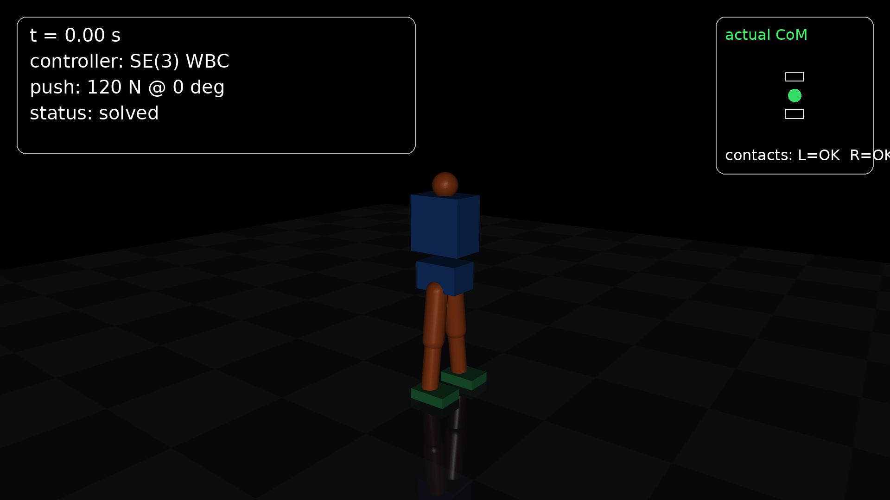
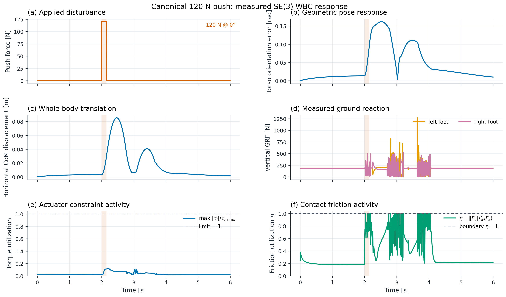
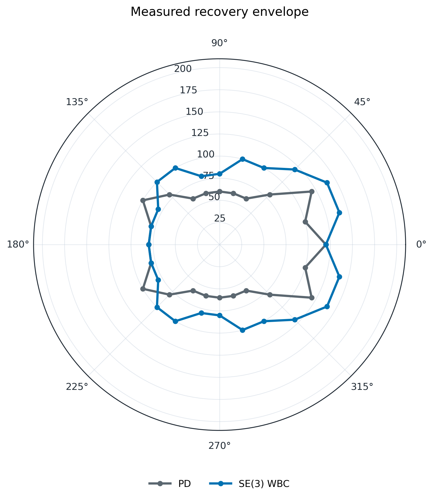
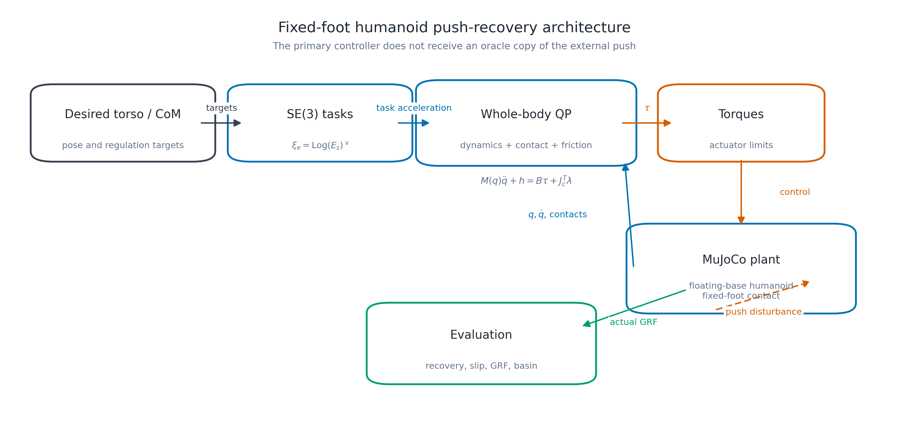
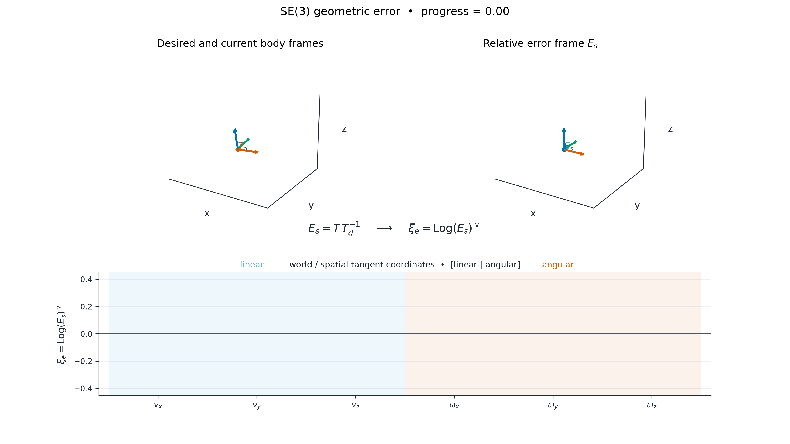
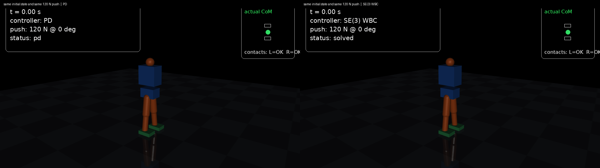
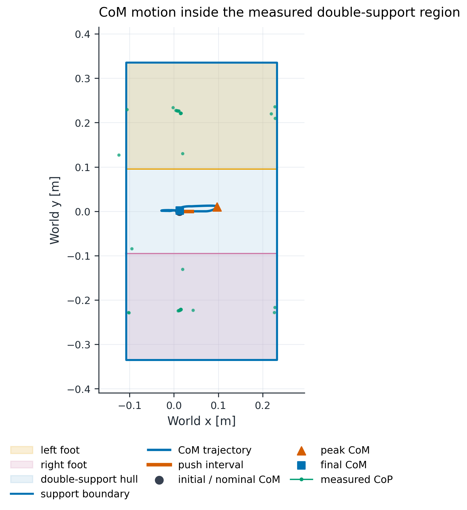

# SE(3) Humanoid Push Recovery

**SE(3) geometric pose-error resolved-acceleration tasks embedded in a contact-constrained whole-body QP for fixed-foot humanoid push recovery.**

The project asks a concrete robotics question: when a floating-base humanoid is pushed, can a whole-body controller regulate the torso while respecting double-support dynamics, unilateral contact, friction, and actuator limits? The external push is applied to the MuJoCo plant; the primary controller does not receive an oracle copy of that force.



## Key measured result

The canonical disturbance is a 120 N horizontal torso push for 0.15 s at 2.0 s. Both controllers use the same plant, disturbance, initial state, and physical recovery classifier.

| Metric | PD | SE(3) WBC |
|---|---:|---:|
| Push-sweep success | 40.0% | 50.8% |
| Canonical recovery | success | success |
| Recovery latency [s] | 0.962 | 1.726 |
| Peak torso error [rad] | 0.174 | 0.162 |
| Peak horizontal CoM displacement [m] | 0.074 | 0.086 |
| Peak actuator torque [N m] | 21.70 | 20.66 |

These are measured values, not general guarantees. PD recovers sooner and has smaller CoM displacement in this canonical trial; SE(3) WBC has lower peak torso error and torque.





## Method



The compact self-contained MuJoCo model has a floating base, pelvis, torso, two articulated legs, two foot contact geoms, actuators, and a ground plane. Physics runs at 0.002 s and control runs at 0.004 s.

### SE(3) convention

For every body, $T_{\mathrm{world}\,body}$ maps body coordinates into the world frame. Production control uses the right-invariant spatial/world error

$$
E_s = T\,T_d^{-1}, \qquad \xi_e = \Log(E_s)^\vee.
$$

The tangent ordering is

$$
\xi = [v_x, v_y, v_z, \omega_x, \omega_y, \omega_z]^T,
$$

and the MuJoCo body Jacobian is interpreted as a spatial/world Jacobian, $V_{\mathrm{world}} = J_{\mathrm{world}}(q)\dot q$. Gains are specified in the desired-body tangent frame and transported with the desired-pose adjoint. A production-task test applies an arbitrary global $G\in SE(3)$ and verifies

$$
E_s' = G E_s G^{-1}, \qquad \xi_e' = \operatorname{Ad}_G\xi_e.
$$

This is a geometric pose-error resolved-acceleration task, not a claim of a globally exact nonlinear tracking law or a formal stability guarantee. The animation uses exactly the same convention:



### Whole-body QP and contact mechanics

The decision variable is $x=[\ddot q,\tau,\lambda_L,\lambda_R]$. The principal constraints are

$$
M(q)\ddot q+h(q,\dot q)=B\tau+J_c^T\lambda,
$$

$$
J_c\ddot q+\dot J_c\dot q=0,
$$

$$
F_z\ge0,\quad |F_x|\le\mu F_z,\quad |F_y|\le\mu F_z,
$$

with support-region CoP limits, torsional friction, torque limits, and acceleration limits. The support limits are derived from the configured foot rectangle rather than arbitrary large moment bounds.

The evaluator keeps the QP-predicted wrench separate from the actual MuJoCo ground reaction. Actual contact forces come from `mj_contactForce`, are transformed to world coordinates, and are summed about each foot body COM. The CoM Jacobian uses `mj_jacBodyCom` and is finite-difference tested.

For measured contact friction,

$$
\eta = \frac{\sqrt{F_x^2+F_y^2}}{\mu F_z},
$$

where $\eta=1$ is the physical friction boundary. Foot slip is classified from measured tangential velocity, XY displacement, and actual friction utilization; the same classifier is used for PD and WBC.

## Experiments and evidence

### Synchronized controller comparison

The two panels use identical camera, scale, timing, initial state, and 120 N push.



The companion [measured controller summary](results/figures/png/controller_comparison.png) reports the recovery-rate and basin statistics without replacing the trial-level evidence above.

### Recovery basin

The deterministic sweep covers 20–200 N in 10 magnitudes and 24 directions. The discrete cells show the measured binary outcome; the polar envelope shows the largest recovered magnitude at each direction.

The full [SE(3) WBC discrete basin](results/figures/png/recovery_heatmap_se3_wbc.png) and [PD discrete basin](results/figures/png/recovery_heatmap_pd.png) remain available alongside the more interpretable polar envelope above.

### CoM and support region

The static and animated views show both measured foot supports, their active double-support convex hull, CoM trajectory, nominal/peak/final CoM, push interval, and sparse measured CoP samples.



The timestamp-correct [animated CoM/support view](results/videos/com_support_polygon.gif) uses the same support-polygon geometry and color system.

### Ground reaction and timing diagnostics

Actual GRF spikes around contact events are retained rather than clipped or hidden. The flagship figure shows vertical GRF, torque utilization $\max_i|\tau_i|/\tau_{i,\max}$ with limit 1, and friction utilization with boundary $\eta=1$. Supplementary diagnostics separate slip speed from friction utilization and report QP mean, p95, p99, maximum, the 4 ms deadline, and deadline-miss percentage.

The canonical WBC timing is mean 1.835 ms, p95 2.233 ms, p99 3.050 ms, maximum 30.911 ms, with 0.267% of solves above the 4 ms deadline. This is an offline timing measurement; no hard-real-time claim is made.

### Perturbed standing and robustness

Quiet standing is only a sanity check. Perturbed standing applies the configured initial torso tilt, CoM offset, and angular velocity directly after nominal initialization; no PD warmup is allowed to erase it. The logged initial state is 0.0167 rad torso error, 0.00151 m CoM displacement, and 0.000764 rad/s torso angular velocity. The resulting direct perturbation is reported honestly: PD fails by measured `SLIP`, WBC by `CONTACT_LOSS`.

The robustness study contains 50 randomized WBC trials across friction 0.3/0.5/0.7/0.9, mass scale 0.9/1.0/1.1, push duration 0.10/0.15/0.20 s, and seeds 0–4. Each seed changes documented initial-state and push variables. This is not presented as hidden model uncertainty.

## Reproduction

Install the local developer environment:

```powershell
py -3.12 -m venv .venv
.\.venv\Scripts\Activate.ps1
python -m pip install -r requirements.txt
python -m pip install -e .
pytest -q
```

Regenerate the presentation layer from the frozen raw NPZ/CSV results:

```powershell
python scripts/generate_figures.py
python scripts/render_system_architecture.py
python scripts/render_geometry_animation.py
python scripts/render_com_support_animation.py
python scripts/render_comparison_video.py
python scripts/run_demo.py
python scripts/render_perturbed_standing.py
```

The long MuJoCo renders are intended for the configured SSH worker. `scripts/remote_sync.ps1` transfers source and results; every measured trial retains configuration, seed, hostname, timestamp, run ID, and raw-data source version. The raw scientific results remain frozen at checkpoint `3be7824`; this visual pass changes presentation and rendering only.

## Repository structure

```text
configs/       robot, controller, experiment, and recovery thresholds
models/        self-contained humanoid XML and attribution
src/           geometry, dynamics, control, evaluation, visualization
experiments/   standing, push, sweep, robustness, and comparison entry points
scripts/       synchronization, plotting, rendering, and provenance helpers
tests/         production geometry, dynamics, contact, QP, and recovery tests
results/       measured data, PNG/PDF figures, videos, and execution logs
```

## Limitations

The study is fixed-foot double support on a compact self-contained MuJoCo model. It does not claim stepping, walking, reinforcement learning, perception, hardware transfer, or a formal recovery guarantee. Contact impulses can be high around impact because the model is small and rigid; actual GRFs are shown so this limitation remains visible. QP timing misses the 4 ms deadline for a small fraction of solves.
