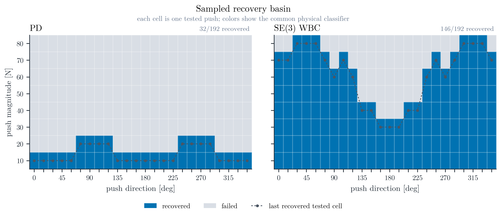
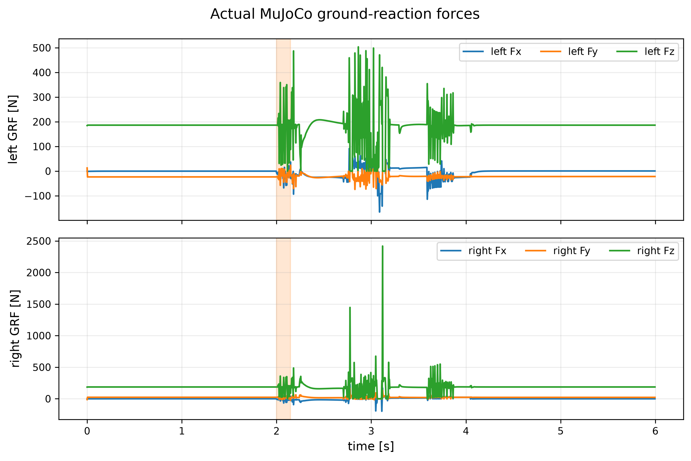
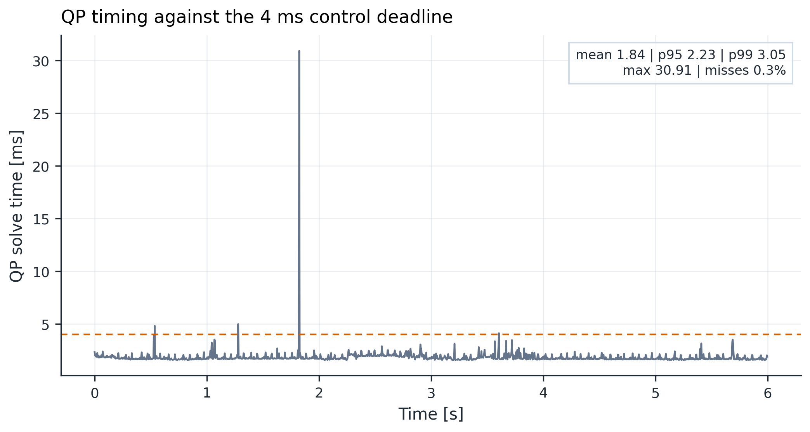

# SE(3) Whole-Body Push Recovery for Unitree G1

> A research codebase and MuJoCo study of geometric torso regulation with a contact-constrained whole-body QP for fixed-foot humanoid push recovery.

  

  <a href="results/videos/geometric_push_recovery.mp4">H.264 demo video</a>
  ·
  <a href="results/videos/pd_vs_se3_wbc_comparison.mp4">PD vs SE(3) WBC comparison</a>
  ·
  <a href="results/figures/png/canonical_response.png">canonical response figure</a>

## Why this matters

Push recovery is a coupled geometry, dynamics, and contact problem. A controller can look stable while violating unilateral contact, friction, actuator, or support constraints—or while benefiting from an oracle copy of the applied disturbance. This project evaluates the complete physical loop instead: the push enters the MuJoCo plant, the primary controller remains disturbance-unaware, and recovery is judged with the same physical classifier for both controllers.

The central question is narrow and testable:

> Can spatial/world-frame SE(3) torso tasks embedded in a whole-body QP improve fixed-foot recovery while respecting floating-base dynamics and double-support contact mechanics?

## Headline result

The canonical trial is a **70 N horizontal torso push at 0°**, applied for **0.15 s** at **t = 2.0 s** to a **35.112 kg** Unitree G1 model. The sweep contains 8 magnitudes × 24 directions × 2 controllers = **384 trials**.

| Measured quantity | Joint PD | SE(3) WBC |
|---|---:|---:|
| Canonical recovery | **failed (`FALL`)** | **recovered** |
| Peak torso orientation error [rad] | 1.8635 | 0.0507 |
| Peak horizontal CoM displacement [m] | 0.8394 | 0.0918 |
| Maximum joint torque [N·m] | 139.00 | 20.28 |
| Recovery latency [s] | — | 0.270 |
| Largest recovered tested push [N] | 20 | 80 |
| Push-sweep recovery | 32/192 (16.7%) | 146/192 (76.0%) |

These are measured results for this model, controller configuration, finite push grid, and physical recovery definition. They are not a claim of universal superiority, walking recovery, or hardware performance.

## Evidence at a glance

### Canonical response

The six-panel response keeps the applied-force interval, orientation error, CoM displacement, actual ground-reaction forces, torque utilization, and friction utilization in one synchronized view. Impact and contact spikes are retained.

### Directional recovery profile

The recovery plot is intentionally Cartesian rather than polar: push direction is the horizontal coordinate and the largest recovered **tested** magnitude is the vertical coordinate. Points are the 24 measured directions; connecting lines are visual guides, not a continuous boundary.

## Method

The control loop has four physically distinct parts:

1. **Reference and task generation** produces torso, CoM, and posture targets from the current measured state.
2. **Geometric tasks** use the production spatial/world-frame error.
3. **Whole-body QP** solves for accelerations, torques, and contact wrenches subject to the physical constraints.
4. **The Unitree G1 MuJoCo plant** receives only the torque signal and the external push. State and contacts feed back to the controller; actual MuJoCo ground-reaction forces feed evaluation.

The production task error is:

$$
E_s = T T_d^{-1}, \qquad \xi_e = \mathrm{Log}(E_s)^\vee.
$$

The tangent vector is ordered as $[v_x,v_y,v_z,\omega_x,\omega_y,\omega_z]^\mathsf{T}$.

The whole-body QP decision vector is:

$$
x = [\ddot q,\tau,\lambda].
$$

The QP retains floating-base dynamics, fixed-foot contact acceleration, torque limits, friction inequalities, support/CoP limits, and bounded task slack.

The QP contact variable $\lambda$ is not treated as a measurement. Actual GRF is extracted from MuJoCo contact forces, transformed to the world frame, and kept separate from the optimizer prediction.

## Experimental scope

| Item | Final study |
|---|---|
| Robot | Unitree G1, 29 actuated DoF, no dexterous hands |
| Model dimensions | $(n_q,n_v,n_u)=(36,35,29)$ with a floating pelvis |
| Contact scope | Fixed-foot double support; no stepping or walking |
| Physics / control | 0.002 s simulation step / 0.004 s control step |
| Canonical push | 70 N at 0°, 0.15 s, applied to the torso at t = 2.0 s |
| Sweep | 10–80 N in 10 N increments, 24 directions at 15° spacing |
| Normalized disturbance | Each trial records $F$, $J=F\Delta t$, $F/(mg)$, and $J/m$ |
| Robustness study | 50 randomized SE(3) WBC trials; 32/50 recovered (64.0%) |
| Evaluation | Common PD/WBC classifier using contact, slip, torso/CoM, actuator, friction, and numerical criteria |

The primary controller does not receive an external-force oracle. The final sweep and robustness data retain failure reasons, measured GRF, friction utilization, torque utilization, seeds, and run provenance.

## Results and demonstrations

### Synchronized controller comparison

The comparison uses the same camera, scale, initial state, push, timestamps, and overlay semantics for Joint PD and SE(3) WBC. The orange push arrow appears only while the disturbance is applied.

[Download the synchronized H.264 comparison](results/videos/pd_vs_se3_wbc_comparison.mp4) · [Open the comparison summary](results/figures/png/controller_comparison.png)

### CoM and support geometry

The support figure combines the measured left and right foot regions, active double-support hull, CoM path, sparse measured CoP, push interval, and initial/peak/final CoM markers with the time-resolved along-push and lateral CoM response.

### Physical contact evidence

Actual ground-reaction forces are shown independently from the QP wrench variable. The timing diagnostic reports mean, p95, p99, maximum, and the 4 ms diagnostic deadline; it is an offline measurement and is not a hard-real-time claim.

  
  

The canonical WBC timing is mean **2.620 ms**, p95 **3.590 ms**, p99 **5.309 ms**, maximum **9.324 ms**, with **3.7%** of solves above the 4 ms diagnostic deadline.

### Geometry convention

The animation uses the same $E_s = T T_d^{-1}$ and $\xi_e = \mathrm{Log}(E_s)^\vee$ convention as the production controller.

## Reproduce the project

### Requirements

- Python **3.10 or newer**
- MuJoCo **3.1 ≤ version < 4** through the project dependencies
- FFmpeg on `PATH` for MP4/GIF generation
- A working OpenGL context for interactive rendering; Linux headless runs can use EGL

The demo and local tests do not require the SSH worker. The committed final raw experiments were executed on the configured worker and include their environment manifests.

### Linux

~~~bash
git clone https://github.com/aimldlnlp/se3-humanoid-push-recovery.git
cd se3-humanoid-push-recovery
python3 -m venv .venv
source .venv/bin/activate
python -m pip install --upgrade pip
python -m pip install -e ".[dev]"

# Only for headless Linux rendering:
export MUJOCO_GL=egl

python scripts/run_demo.py
python -m pytest -q
~~~

Install FFmpeg with the package manager appropriate for the machine, for example `sudo apt install ffmpeg` on Debian/Ubuntu.

### macOS

~~~bash
git clone https://github.com/aimldlnlp/se3-humanoid-push-recovery.git
cd se3-humanoid-push-recovery
python3 -m venv .venv
source .venv/bin/activate
python -m pip install --upgrade pip
python -m pip install -e ".[dev]"
python scripts/run_demo.py
python -m pytest -q
~~~

Install FFmpeg with Homebrew when video encoding is needed: `brew install ffmpeg`.

### Windows PowerShell

~~~powershell
git clone https://github.com/aimldlnlp/se3-humanoid-push-recovery.git
Set-Location se3-humanoid-push-recovery
py -3 -m venv .venv
.\\.venv\\Scripts\\Activate.ps1
python -m pip install --upgrade pip
python -m pip install -e ".[dev]"
python scripts\\run_demo.py
python -m pytest -q
~~~

If PowerShell blocks activation, run `Set-ExecutionPolicy -Scope CurrentUser RemoteSigned` once, or invoke the environment Python directly. Install FFmpeg separately and make sure `ffmpeg.exe` is available on `PATH` for video output.

### Regenerate figures from committed raw data

The figure pipeline reads the saved NPZ/CSV artifacts; it does not rerun an experiment:

~~~bash
python scripts/generate_figures.py
~~~

The generated PNG/PDF/SVG files are written under `results/figures/`. The demo writes a saved trajectory and rendered video under `results/data/` and `results/videos/`.

### Run the full experiment sequence

These commands write new files under `results/` and are intended for a clean checkout or an isolated artifact directory:

~~~bash
python experiments/standing.py
python experiments/perturbed_standing.py
python experiments/single_push.py
python experiments/push_calibration.py
python experiments/push_sweep.py
python experiments/robustness.py
python scripts/generate_figures.py
~~~

For repeatable worker runs, set `SE3_SOURCE_VERSION` and `SE3_RUN_ID` in the environment and retain the generated manifests in `results/logs/`. The sweep and calibration scripts support process parallelism through `SE3_SWEEP_WORKERS`, `SE3_CALIBRATION_WORKERS`, and `SE3_ROBUSTNESS_WORKERS`.

## Repository map

~~~text
src/se3_whole_body_control/
  geometry/       SO(3)/SE(3) operations and frame conventions
  control/        Joint PD and contact-constrained whole-body QP
  dynamics/       Floating-base humanoid model and Jacobians
  simulation/     MuJoCo runner, contacts, and state logging
  evaluation/     Recovery classifier and trial metrics
  visualization/  Paper figures, renderer, videos, and font resolver
experiments/      Standing, push, calibration, sweep, and robustness runners
configs/          Robot, controller, and experiment configuration
models/unitree_g1/ Pinned G1 MJCF, meshes, provenance, and upstream license
results/data/     Raw NPZ/CSV trial artifacts
results/figures/  PNG, PDF, and SVG figures
results/videos/   GIF and MP4 demonstrations
tests/            Geometry, frame, contact, dynamics, mapping, and metric tests
docs/figures/     Reproducible architecture figure sources and candidates
~~~

## Provenance and model attribution

The numerical results shown above were generated from source checkpoint `a0d5055da703e8256333b50ffbee85d88abbefc2`. The final experiment configuration hash is `a8a272a147a3f6095811987e6623d4d5c4915d6985955e7af60c1d155ddd62d9`. Raw manifests record the source version, run ID, seed, hostname, UTC timestamp, and configuration hash; the [source-freeze record](results/logs/source_freeze.txt) contains the run IDs and gate sequence. Later documentation or visualization commits are not relabeled as new numerical experiments.

The final worker environment was:

- hostname: `hucenrotia-ai`
- Python: `3.12.3`
- MuJoCo: `3.11.0`
- FFmpeg: `6.1.1`
- GPU: NVIDIA RTX A5000

The primary model is the official Unitree Robotics `g1_29dof.xml` torque-actuated MJCF without dexterous hands, pinned to [unitree_mujoco commit `ae6a8403e272733e9996ef59990880330496177f`](https://github.com/unitreerobotics/unitree_mujoco/tree/ae6a8403e272733e9996ef59990880330496177f/unitree_robots/g1). The upstream XML, meshes, motor-order documentation, model rationale, and license are retained in [models/unitree_g1/](models/unitree_g1/).

The pinned upstream revision also contains a file named `g1_23dof.xml`, but its current version includes six simulator placeholder joints/actuators outside the physical 23-DoF tree. The 29-DoF no-hands variant is therefore used because it provides an unambiguous physically connected actuator map. The legacy `mini_humanoid` remains selectable and is preserved under [results/legacy_mini_humanoid/](results/legacy_mini_humanoid/); its measurements are not mixed with G1 evidence.

## Limitations

- This is a MuJoCo simulation study of **fixed-foot double support**. It does not evaluate walking, stepping recovery, hardware, perception, or whole-body manipulation.
- The controller is disturbance-unaware and does not receive an external-force oracle.
- The recovery basin is finite and directional: it is a sampled measured envelope over the tested grid, not a continuous or formal stability boundary.
- Actual MuJoCo GRF is a physical contact measurement and is distinct from the QP-predicted wrench $\lambda$.
- Recovery uses a declared threshold-based classifier shared by PD and WBC; changing the thresholds or discarding failed trials would invalidate the comparison.
- QP timings are offline diagnostics. The observed deadline misses mean no hard-real-time claim is made.
- No universal superiority claim is made: the study reports the measured behavior of the specified G1 model, gains, contacts, disturbance range, and evaluation protocol.

## Citation

Until a peer-reviewed publication is associated with this repository, cite the software artifact and the upstream robot model:

~~~bibtex
@software{aimldlnlp_se3_g1_push_recovery,
  author  = {{aimldlnlp}},
  title   = {SE(3) Whole-Body Push Recovery for Unitree G1},
  year    = {2026},
  url     = {https://github.com/aimldlnlp/se3-humanoid-push-recovery}
}
~~~

For work that redistributes or builds on the robot asset, also retain the Unitree attribution and terms in [models/unitree_g1/LICENSE.txt](models/unitree_g1/LICENSE.txt) and [models/unitree_g1/UPSTREAM.md](models/unitree_g1/UPSTREAM.md).

## License and attribution

The bundled Unitree G1 model is distributed under the upstream **BSD-3-Clause** license, reproduced in [models/unitree_g1/LICENSE.txt](models/unitree_g1/LICENSE.txt). The repository currently does not declare a separate top-level license for project-owned source code; check the repository owner’s terms before redistributing code or generated data. MuJoCo and all other third-party components remain subject to their own licenses.
