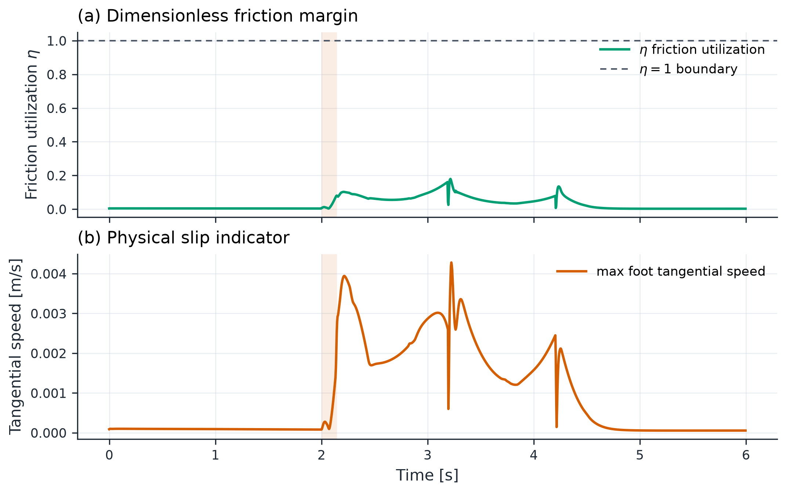

# Unitree G1 SE(3) Whole-Body Push Recovery

**SE(3) geometric pose-error resolved-acceleration tasks embedded in a contact-constrained whole-body QP for fixed-foot humanoid push recovery.**

The project asks a concrete robotics question: when a floating-base humanoid is pushed, can a whole-body controller regulate the torso while respecting double-support dynamics, unilateral contact, friction, and actuator limits? The external push is applied to the MuJoCo plant; the primary controller does not receive an oracle copy of that force.


## Measured G1 result

The frozen canonical trial uses the same initial state, plant, camera, and physical recovery classifier for both controllers: a 70 N horizontal torso push at 0 degrees, applied for 0.15 s from $t=2.0$ s. For the 35.112 kg model this is $F/(mg)=0.2032$ and impulse/mass $J/m=0.2990$ m/s.

| Metric | Joint PD | SE(3) WBC |
|---|---:|---:|
| Canonical recovery | failed: `FALL` | recovered |
| Recovery latency [s] | — | 0.270 |
| Peak torso error [rad] | 1.8635 | 0.0507 |
| Peak horizontal CoM displacement [m] | 0.8394 | 0.0918 |
| Maximum actuator torque [N m] | 139.00 | 20.28 |
| Largest recovered tested push [N] | 20 | 80 |
| Push-sweep recovery | 32/192 (16.7%) | 146/192 (76.0%) |

The sweep contains 10–80 N at 24 directions spaced by 15 degrees. The envelope is a discrete, sampled measured result—not a theoretical continuous recovery boundary and not a claim of universal superiority. The canonical response is shown in the [3x2 paper-style figure](results/figures/png/canonical_response.png); the [comparison summary](results/figures/png/controller_comparison.png), [WBC basin](results/figures/png/recovery_heatmap_se3_wbc.png), [PD basin](results/figures/png/recovery_heatmap_pd.png), and [sampled polar envelope](results/figures/png/recovery_envelope.png) retain the trial-level evidence.

These are measured results from the final rerun at source checkpoint `a0d5055da703e8256333b50ffbee85d88abbefc2` (`final-a0d5055-sweep`, `final-a0d5055-robustness`). The earlier G1 artifact is retained as a previous/frozen run in Git history and was not mixed into these numbers.


## Robot and provenance

The primary model is the official Unitree Robotics `g1_29dof.xml` torque-actuated MJCF without dexterous hands, pinned to `unitree_mujoco` commit [`ae6a8403e272733e9996ef59990880330496177f`](https://github.com/unitreerobotics/unitree_mujoco/tree/ae6a8403e272733e9996ef59990880330496177f/unitree_robots/g1). The project includes the upstream XML, meshes, motor-order documentation, and BSD-3-Clause license in [`models/unitree_g1/`](models/unitree_g1/).

The selected model has 29 actuated DoF, $(n_q,n_v,n_u)=(36,35,29)$, a floating pelvis, `torso_link`, two ankle-roll foot bodies, and physically connected torque actuators. The upstream revision also contains `g1_23dof.xml`, but its current file includes six simulator placeholder joints/actuators outside the physical 23-DoF tree. The 29-DoF variant is therefore used as the closest maintained, unambiguous no-hands G1 model; the reason and exact pin are recorded in [`models/unitree_g1/UPSTREAM.md`](models/unitree_g1/UPSTREAM.md).

The legacy compact robot remains selectable as `mini_humanoid` and its original measurements are preserved under [`results/legacy_mini_humanoid/`](results/legacy_mini_humanoid/). No compact-humanoid numbers are used as G1 evidence.

## Method


The architecture is generated from the editable TikZ source in [`docs/figures/system_architecture.tex`](docs/figures/system_architecture.tex); the dashed controller boundary excludes the MuJoCo plant, while measured GRF remains an evaluation-only physical measurement.

Regenerate the final figure and the three comparison layouts with `python scripts/render_system_architecture.py` (set `TECTONIC_BIN` and `PDFTOPPM_BIN` when those tools are not on `PATH`).

The primary plant is Unitree G1 in MuJoCo. Physics runs at 0.002 s and control runs at 0.004 s. The robot adapter supplies the floating base, pelvis and torso bodies, feet, actuated joints, limits, nominal pose, support vertices, mass/CoM, Jacobians, and contact definitions; the legacy `mini_humanoid` uses the same interface.

### Production SE(3) task

For a body transform $T$ and desired transform $T_d$, production control uses the spatial/world-frame convention

$$
E_s = T T_d^{-1}, \qquad \xi_e = \operatorname{Log}(E_s)^\vee.
$$

The tangent vector is ordered as

$$
\xi_e = [v_x,v_y,v_z,\omega_x,\omega_y,\omega_z]^T,
$$

with linear components first and angular components second. The MuJoCo body Jacobian is interpreted as a spatial/world Jacobian. The production-task equivariance test verifies, for a global $G\in SE(3)$, that $E_s'=G E_s G^{-1}$ and $\xi_e'=\operatorname{Ad}_G\xi_e$. The [SE(3) animation](results/videos/se3_geometry.gif) uses exactly this convention.


### Whole-body QP and contacts

The decision vector is

$$
x=[\ddot q,\tau,\lambda].
$$

The constrained problem retains floating-base dynamics, fixed-foot double-support acceleration, torque limits, friction inequalities, support-polygon/CoP limits, and bounded task slack:

$$
M(q)\ddot q+h(q,\dot q)=B\tau+J_c^T\lambda,
$$

$$
J_c\ddot q+\dot J_c\dot q=0.
$$

For each measured ground reaction, the friction utilization is

$$
\eta=\frac{\sqrt{F_x^2+F_y^2}}{\mu F_z},
$$

where $\eta=1$ is the physical friction boundary. The QP-predicted contact wrench is kept separate from the actual MuJoCo ground-reaction wrench. Actual GRFs are extracted from `mj_contactForce`, transformed to the world frame, and summed about the foot body. PD and WBC use the same recovery classifier, including contact loss, measured slip, torso/CoM limits, actuator limits, and numerical failure.


## Experiments

### Synchronized PD versus SE(3) WBC

The two panels use identical camera, scale, push, timestamps, and G1 initial state. The overlay reports actual contacts and solver state; an orange push arrow appears only during the applied disturbance.


See the [H.264 comparison video](results/videos/pd_vs_se3_wbc_comparison.mp4) and [summary figure](results/figures/png/controller_comparison.png).

### Recovery basin and robustness

The push sweep contains 384 trials: 192 PD and 192 SE(3) WBC trials over 8 magnitudes and 24 directions. Every row records force, impulse, $F/(mg)$, $J/m$, seed, mass, measured GRF, friction utilization, recovery result, and failure reason in [results/data/push_sweep.csv](results/data/push_sweep.csv). The polar plot reports the largest recovered tested push by direction.

The randomized robustness study contains 50 SE(3) WBC trials, with 32/50 recoveries (64.0%), over friction $\mu\in\{0.3,0.5,0.7,0.9\}$, mass scale $\in\{0.9,1.0,1.1\}$, push duration $\in\{0.10,0.15,0.20\}$ s, and seeds 0–4. Results are in [results/data/robustness.csv](results/data/robustness.csv).

### CoM and support region

The static and animated views show both measured foot supports, their active double-support convex hull, CoM trajectory, nominal/peak/final CoM, push interval, and sparse measured CoP samples. The [animated CoM/support view](results/videos/com_support_polygon.gif) uses the same support-polygon geometry and color system.

### Standing, perturbation, and timing

Quiet standing is a physics sanity check, not a recovery claim. In the final source, both controllers maintain both contacts. The WBC quiet-standing run has peak torso error 0.00344 rad and peak CoM displacement 0.00416 m; the PD run has 0.02795 rad and 0.01475 m. The contact-preserving perturbed-standing gate uses a randomized initial angular velocity bounded by 0.05 rad/s; both final trials recover with both feet in contact. The [perturbed-standing animation](results/videos/perturbed_standing_recovery.gif) is available separately.

Actual GRF spikes around contact events are retained rather than clipped or hidden. The canonical WBC QP timing is mean 2.620 ms, p95 3.590 ms, p99 5.309 ms, maximum 9.324 ms, with 3.7% of solves above the 4 ms diagnostic deadline. These are offline measurements; this project makes no hard-real-time claim. See the [timing diagnostic](results/figures/png/qp_timing_diagnostics.png).



## Verification and reproduction

The final source checkpoint was created before the final G1 experiments:

```text
a0d5055da703e8256333b50ffbee85d88abbefc2
```

All final raw runs carry this full source version plus a run ID, seed, hostname, UTC timestamp, and configuration hash in their manifests. The final configuration hash is `a8a272a147a3f6095811987e6623d4d5c4915d6985955e7af60c1d155ddd62d9`; the worker was `hucenrotia-ai` with Python 3.12.3, MuJoCo 3.11.0, FFmpeg 6.1.1, and an NVIDIA RTX A5000. The final raw artifacts include [JSON summaries](results/data/), [NPZ trajectories](results/data/), [CSV sweeps](results/data/push_sweep.csv), [PNG/PDF figures](results/figures/), [GIF/MP4 videos](results/videos/), and [execution logs](results/logs/).

The deterministic calibration used 10, 20, 40, 60, 80, and 100 N at eight directions for both controllers; the final 10–80 N grid was retained because it contains easy, near-boundary, and failed recoveries. The provenance record is in [`results/logs/source_freeze.txt`](results/logs/source_freeze.txt), with aggregate run manifests in [`results/logs/`](results/logs/).

Run the lightweight local suite with:

```powershell
py -3.12 -m venv .venv
.\.venv\Scripts\Activate.ps1
python -m pip install -r requirements.txt
python -m pip install -e .
pytest -q
```

The full MuJoCo suite and final sweeps were executed on the configured SSH worker. The worker-side sequence followed G1 load/mapping, standing, Jacobian and mass, contact/support, gravity compensation, PD/WBC standing, perturbation, canonical push, calibration, sweep, and robustness gates. The final source tests passed remotely before the checkpoint; final results were then run from that exact checkpoint.

## Scope and limitations

This is a simulation study of fixed-foot double support. It does not claim walking, stepping recovery, hardware validation, perception, formal nonlinear stability, hard real-time control, or universal superiority over PD. The disturbance is external and applied to the plant, while the controller remains disturbance-unaware. The measured basin is finite and directional; failures and GRF spikes are retained in the raw data and figures. Actual GRF is a MuJoCo contact measurement, not the QP's predicted wrench.

The project is distributed with the upstream Unitree model attribution and license. No credentials or machine-specific absolute paths are required for reproduction.
