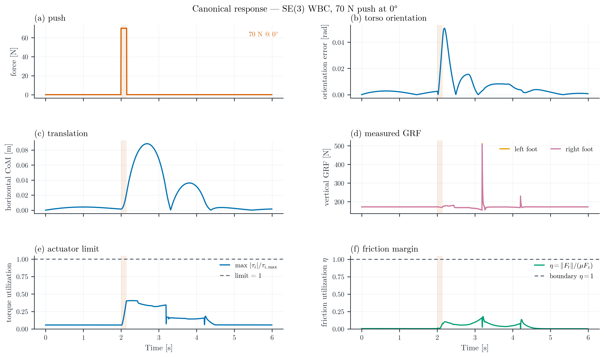
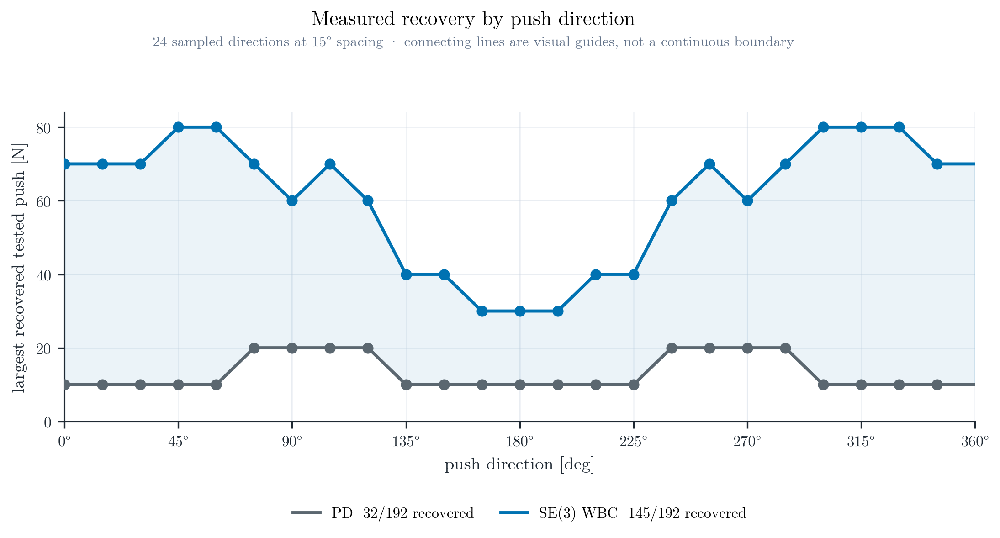
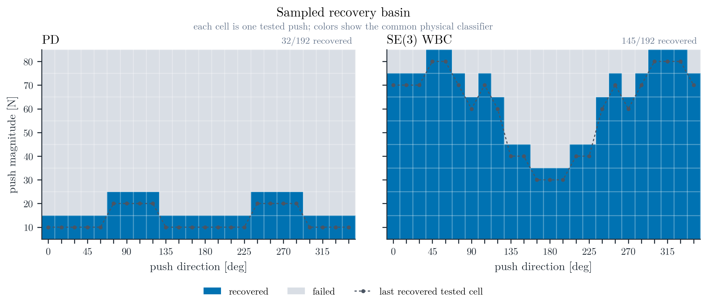
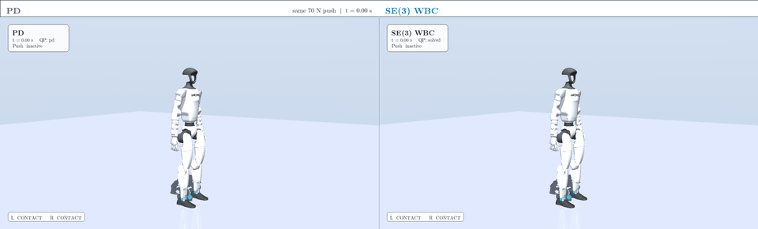
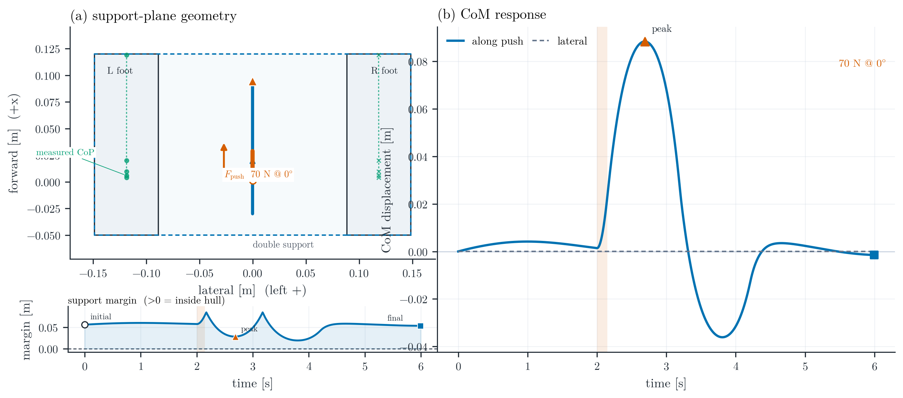
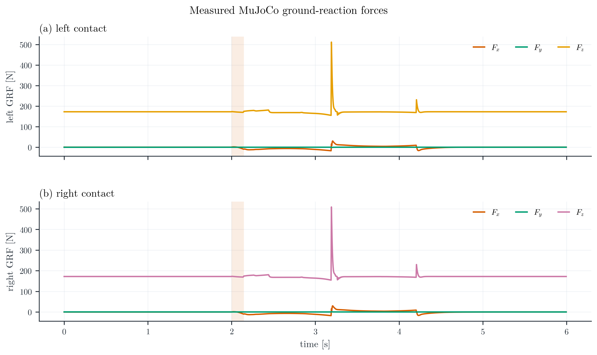
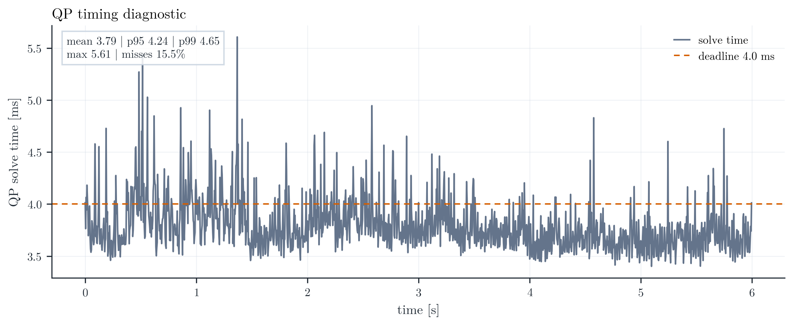

# G1 Adaptive Recovery Arena

> A polished Unitree G1 MuJoCo system that chooses between fixed-foot stabilization, measured stepping, bounded second-step recovery, and transparent failure.

<p align="center">
  
</p>

<p align="center">
  <a href="artifacts/arena/arena_final_render_20260817/g1_adaptive_recovery_arena_story.mp4">Adaptive Arena hero video</a>
  ·
  <a href="artifacts/arena/arena_final_render_20260817/manifest.json">Arena manifest</a>
  ·
  <a href="results/revalidation/g1_6024ce9/videos/geometric_push_recovery.mp4">H.264 demo video</a>
  ·
  <a href="results/revalidation/g1_6024ce9/videos/pd_vs_se3_wbc_comparison.mp4">PD vs SE(3) WBC comparison</a>
  ·
  <a href="results/revalidation/g1_6024ce9/figures/canonical_response.png">canonical response figure</a>
</p>

## Why this matters

Recovery is a coupled geometry, dynamics, and contact problem. The arena keeps the validated SE(3) whole-body QP as its low-level substrate, then adds a measured contact-mode supervisor. A push enters the MuJoCo plant, the controller does not receive the configured push as an oracle, and every decision is logged against post-step MuJoCo contacts and ground-reaction forces.

The portfolio story is intentionally easy to read:

> small push → stabilize; larger push → step; stronger disturbance → adapt again or fail clearly.

The current stepping branch is a bounded recovery demonstrator, not a walking controller. Its artifacts deliberately preserve the case where the first foot loads successfully but a second capture step still fails.

## Adaptive Recovery Arena

The deterministic arena scenarios are generated by `experiments/adaptive_recovery_arena.py` into a new output root:

| Scenario | Intended mode | SSH-validated outcome |
|---|---|---|
| `stabilize_40N` | fixed-foot double support | recovered; no step |
| `step_75N` | first step, then bounded second-step attempt | one measured touchdown; final `FALL` is preserved |
| `lateral_70N` | direction-aware no-step boundary | CoM stabilizes, but classifier records measured `SLIP` |
| `overload_100N` | overload boundary | step attempt fails transparently |

Each run saves raw trial arrays, event timelines, telemetry figures, a manifest, and an aggregate CSV. The manifest records the source version, configuration/model hashes, host, Python/dependency versions, command, seed, and artifact root.

The final rendered SSH evidence is packaged under [`artifacts/arena/arena_final_render_20260817/`](artifacts/arena/arena_final_render_20260817/), including the hero video/GIF, compact per-scenario videos, telemetry plots, summary, manifest, and the exact remote model/config snapshots used for provenance.

## Headline result

The canonical trial is a **70 N horizontal torso push at 0°**, applied for **0.15 s** at **t = 2.0 s** to a **35.112 kg** Unitree G1 model. The sweep contains 8 magnitudes × 24 directions × 2 controllers = **384 trials**.

| Measured quantity | Joint PD | SE(3) WBC |
|---|---:|---:|
| Canonical recovery | **failed (`FALL`)** | **recovered** |
| Peak torso orientation error [rad] | 1.7388 | 0.0507 |
| Peak horizontal CoM displacement [m] | 0.7803 | 0.0918 |
| Maximum joint torque [N·m] | 139.00 | 20.28 |
| Recovery latency [s] | — | 0.270 |
| Largest recovered tested push [N] | 20 | 80 |
| Push-sweep recovery | 32/192 (16.7%) | 145/192 (75.5%) |

These are measured results for this model, controller configuration, finite push grid, and physical recovery definition. They are not a claim of universal superiority, walking recovery, or hardware performance.

## What changed in the latest milestone

The project now has two explicit layers:

- The historical fixed-foot SE(3) WBC benchmark remains intact under `results/` and is not relabeled as a stepping result.
- The adaptive arena adds post-step physical contact telemetry, support-margin/event overlays, deterministic scenario presets, measured landing gates, bounded foot placement, explicit touchdown/failure events, and replayable raw trial bundles.

Trust-critical corrections include refreshed MuJoCo mass-derived constants after mass scaling, physical post-step GRF/CoP/slip measurements kept separate from QP wrench predictions, horizontal-CoM metrics, and a NumPy 2.5-compatible support hull implementation. The stepping supervisor only switches modes from measured state; it does not use the configured push as a control oracle.

## Evidence at a glance

### Canonical response

The six-panel response keeps the applied-force interval, orientation error, CoM displacement, actual ground-reaction forces, torque utilization, and friction utilization in one synchronized view. Impact and contact spikes are retained.



### Directional recovery profile

The recovery plot is intentionally Cartesian rather than polar: push direction is the horizontal coordinate and the largest recovered **tested** magnitude is the vertical coordinate. Points are the 24 measured directions; connecting lines are visual guides, not a continuous boundary.





## Adaptive controller architecture

```text
MuJoCo state + post-step contacts
              │
              ▼
  recovery supervisor / event log
   ├─ double support: hold SE(3) tasks
   ├─ transfer: choose trailing foot and target
   ├─ single support: swing with remaining-foot constraints
   ├─ landing: require measured load, position, and tangent-speed gate
   └─ bounded second step or explicit failure
              │
              ▼
       SE(3) whole-body QP → torque-only plant input
```

The controller reports both predicted QP quantities and measured post-step quantities. Contact events are not inferred from solver mode alone: touchdown requires actual MuJoCo foot load and a debounced landing observation.

## Method


The control loop has four physically distinct parts:

1. **Reference and task generation** produces torso, CoM, and posture targets from the current measured state.
2. **Geometric tasks** use the production spatial/world-frame error.
3. **Whole-body QP** solves for accelerations, torques, and contact wrenches subject to the physical constraints.
4. **The Unitree G1 MuJoCo plant** receives only the torque signal and the external push. State and contacts feed back to the controller; actual MuJoCo ground-reaction forces feed evaluation.

The production task error is:

$$
E_s = T T_d^{-1}, \qquad \xi_e = \mathrm{Log}(E_s)^\vee.
$$

The tangent vector is ordered as $[v_x,v_y,v_z,\omega_x,\omega_y,\omega_z]^\mathsf{T}$.

The whole-body QP decision vector is:

$$
x = [\ddot q,\tau,\lambda].
$$

The QP retains floating-base dynamics, fixed-foot contact acceleration, torque limits, friction inequalities, support/CoP limits, and bounded task slack.

The QP contact variable $\lambda$ is not treated as a measurement. Actual GRF is extracted from MuJoCo contact forces, transformed to the world frame, and kept separate from the optimizer prediction.

## Experimental scope

| Item | Final study |
|---|---|
| Robot | Unitree G1, 29 actuated DoF, no dexterous hands |
| Model dimensions | $(n_q,n_v,n_u)=(36,35,29)$ with a floating pelvis |
| Contact scope | Double support, measured single-support swing, bounded second step; no walking |
| Physics / control | 0.002 s simulation step / 0.004 s control step |
| Canonical push | 70 N at 0°, 0.15 s, applied to the torso at t = 2.0 s |
| Sweep | 10–80 N in 10 N increments, 24 directions at 15° spacing |
| Normalized disturbance | Each trial records $F$, $J=F\Delta t$, $F/(mg)$, and $J/m$ |
| Robustness study | 50 randomized SE(3) WBC trials; 32/50 recovered (64.0%) |
| Arena run | `arena_final_render_20260817` on SSH worker `hucenrotia-ai` |
| Arena scenarios | 40 N stabilize, 75 N step boundary, 70 N lateral slip boundary, 100 N overload |
| Evaluation | Common PD/WBC classifier using contact, slip, torso/CoM, actuator, friction, and numerical criteria |

The primary controller does not receive an external-force oracle. Arena data retain failure reasons, pre/post-step contacts, measured GRF, friction utilization, torque utilization, event timelines, seeds, and run provenance. A successful touchdown is not treated as a successful recovery unless the final physical classifier also reports stable behavior.

## Results and demonstrations

### Synchronized controller comparison

The comparison uses the same camera, scale, initial state, push, timestamps, and overlay semantics for Joint PD and SE(3) WBC. The orange push arrow appears only while the disturbance is applied.



[Download the synchronized H.264 comparison](results/revalidation/g1_6024ce9/videos/pd_vs_se3_wbc_comparison.mp4) · [Open the comparison summary](results/revalidation/g1_6024ce9/figures/controller_comparison.png)

### CoM and support geometry

The support figure combines the measured left and right foot regions, active double-support hull, CoM path, sparse measured CoP, push interval, and initial/peak/final CoM markers with the time-resolved along-push and lateral CoM response.



### Physical contact evidence

Actual ground-reaction forces are shown independently from the QP wrench variable. The timing diagnostic reports mean, p95, p99, maximum, and the 4 ms diagnostic deadline; it is an offline measurement and is not a hard-real-time claim.

<p align="center">
  
  
</p>

The canonical revalidation WBC timing is mean **3.789 ms**, p95 **4.238 ms**, p99 **4.652 ms**, maximum **5.607 ms**, with **15.5%** of solves above the 4 ms diagnostic deadline. This is an offline diagnostic, not a hard-real-time guarantee.

The canonical contact-consistency diagnostic reports **7.63 N** total-force RMSE and **13.18 N** vertical-GRF RMSE between the QP prediction and the physical MuJoCo measurement. The quantities are intentionally kept separate: $\lambda$ is an optimizer variable, while GRF is extracted from simulated contact forces.

### Geometry convention


The animation uses the same $E_s = T T_d^{-1}$ and $\xi_e = \mathrm{Log}(E_s)^\vee$ convention as the production controller.

## Reproduce the project

### Requirements

- Python **3.10 or newer**
- MuJoCo **3.1 ≤ version < 4** through the project dependencies
- FFmpeg on `PATH` for MP4/GIF generation
- `glfw` for MuJoCo off-screen rendering on desktop platforms (installed by the project dependencies)
- A working OpenGL context for interactive rendering; Linux headless runs can use EGL

For the current arena milestone, SSH is the execution environment for MuJoCo simulation, rendering, and physical-behavior validation. Local use is limited to source inspection, editing, static checks, and light tests. The validated worker endpoint resolves to hostname `hucenrotia-ai`, user `aimldl`, Python 3.12.3, MuJoCo 3.11.0, OSQP 1.1.3, and an NVIDIA RTX A5000. The SSH aliases `aimldl` and `hucenrotia` were not resolvable in this execution context; the endpoint was verified explicitly and is recorded in manifests.

### Linux

~~~bash
git clone https://github.com/aimldlnlp/se3-humanoid-push-recovery.git
cd se3-humanoid-push-recovery
python3 -m venv .venv
source .venv/bin/activate
python -m pip install --upgrade pip
python -m pip install -e ".[dev]"

# Only for headless Linux rendering:
export MUJOCO_GL=egl

python scripts/run_demo.py
python -m pytest -q

# Adaptive arena; use a fresh output root for every run.
python experiments/adaptive_recovery_arena.py --output-root arena
~~~

Install FFmpeg with the package manager appropriate for the machine, for example `sudo apt install ffmpeg` on Debian/Ubuntu.

### macOS

~~~bash
git clone https://github.com/aimldlnlp/se3-humanoid-push-recovery.git
cd se3-humanoid-push-recovery
python3 -m venv .venv
source .venv/bin/activate
python -m pip install --upgrade pip
python -m pip install -e ".[dev]"
python scripts/run_demo.py
python -m pytest -q
~~~

Install FFmpeg with Homebrew when video encoding is needed: `brew install ffmpeg`.

### Windows PowerShell

~~~powershell
git clone https://github.com/aimldlnlp/se3-humanoid-push-recovery.git
Set-Location se3-humanoid-push-recovery
py -3 -m venv .venv
.\\.venv\\Scripts\\Activate.ps1
python -m pip install --upgrade pip
python -m pip install -e ".[dev]"
python scripts\\run_demo.py
python -m pytest -q
~~~

If PowerShell blocks activation, run `Set-ExecutionPolicy -Scope CurrentUser RemoteSigned` once, or invoke the environment Python directly. Install FFmpeg separately and make sure `ffmpeg.exe` is available on `PATH` for video output.

### Regenerate figures from committed raw data

The figure pipeline reads the saved NPZ/CSV artifacts; it does not rerun an experiment:

~~~bash
python scripts/generate_figures.py
~~~

The generated PNG/PDF/SVG files are written under `results/figures/`. The latest frozen revalidation artifacts are preserved under [`results/revalidation/g1_6024ce9/`](results/revalidation/g1_6024ce9/); the older `results/data/` and `results/videos/` remain available as the previous baseline.

### Run the arena on the SSH worker

The worker command below is representative; use a new output root and set the source version used for the run:

~~~bash
ssh aimldl@140.113.149.94
cd /home/aimldl/workspaces/se3-humanoid-push-recovery-arena-20260817/source
SE3_SOURCE_VERSION=<commit-or-source-tree-id> PYTHONPATH=src \
  /home/aimldl/.venvs/se3-wbc/bin/python experiments/adaptive_recovery_arena.py \
  --output-root arena_<timestamp>
~~~

Inspect `logs/manifest.json`, `logs/summary.json`, each `data/trials/*.json`, and the telemetry PNGs before interpreting a video. The script refuses to overwrite a non-empty arena output root.

### Run the full experiment sequence

These commands write new files under `results/` and are intended for a clean checkout or an isolated artifact directory:

~~~bash
python experiments/standing.py
python experiments/perturbed_standing.py
python experiments/single_push.py
python experiments/push_calibration.py
python experiments/push_sweep.py
python experiments/robustness.py
python scripts/generate_figures.py
~~~

For repeatable worker runs, set `SE3_SOURCE_VERSION` and `SE3_RUN_ID` in the environment and retain the generated manifests in `results/logs/`. The sweep and calibration scripts support process parallelism through `SE3_SWEEP_WORKERS`, `SE3_CALIBRATION_WORKERS`, and `SE3_ROBUSTNESS_WORKERS`.

## Repository map

~~~text
src/se3_whole_body_control/
  geometry/       SO(3)/SE(3) operations and frame conventions
  control/        Joint PD and contact-constrained whole-body QP
  dynamics/       Floating-base humanoid model and Jacobians
  simulation/     MuJoCo runner, contacts, and state logging
  evaluation/     Recovery classifier and trial metrics
  visualization/  Paper figures, renderer, videos, and font resolver
experiments/      Standing, push, calibration, sweep, robustness, and arena runners
configs/          Robot, controller, and experiment configuration
models/unitree_g1/ Pinned G1 MJCF, meshes, provenance, and upstream license
results/data/     Raw NPZ/CSV trial artifacts
results/figures/  PNG, PDF, and SVG figures
arena*/           Read-only local copies of SSH arena runs (never historical results)
tests/            Geometry, frame, contact, dynamics, mapping, and metric tests
docs/figures/     Reproducible architecture figure sources and candidates
~~~

## Provenance and model attribution

Historical fixed-foot numbers were generated from source checkpoint `6024ce9af3b63d62c584d120fe2309ef10297198`; their manifests and raw artifacts remain under [`results/revalidation/g1_6024ce9/`](results/revalidation/g1_6024ce9/). They are not silently mixed with the arena runs.

The final rendered arena run was executed on SSH with:

- hostname: `hucenrotia-ai`
- user: `aimldl`
- Python: `3.12.3` from `/home/aimldl/.venvs/se3-wbc/bin/python`
- NumPy: `2.5.2`; MuJoCo: `3.11.0`; OSQP: `1.1.3`
- GPU: NVIDIA RTX A5000 (rendering/compute host)
- model: `models/unitree_g1/scene_push_recovery.xml`, SHA-256 `613781e1b87d4e0d028332bfec4be9f2db53e2ddb252c0157bcaf04de88c0d76`
- source checkpoint declared by the run: `a854c22` (`Build G1 adaptive recovery arena`)
- manifest config hash: `8838329461a2d383e0564352aa69db40e9ddb13807635ac7f6c28836ee1653ef`
- remote run: `arena_final_render_20260817`, seed `0`, rendered `true`

The exact configuration, command, timestamp, dependency versions, model hash, and artifact paths are recorded in the packaged [`manifest.json`](artifacts/arena/arena_final_render_20260817/manifest.json). The SSH workspace had no Git metadata, so `a854c22` is the source version declared in the execution environment rather than a remote `git rev-parse` result; GitHub remains authoritative. The worker scene uses CRLF line endings, while the tracked local scene uses LF; normalized XML content is identical and the exact worker snapshot is retained under `artifacts/arena/arena_final_render_20260817/provenance/`.

The primary model is the official Unitree Robotics `g1_29dof.xml` torque-actuated MJCF without dexterous hands, pinned to [unitree_mujoco commit `ae6a8403e272733e9996ef59990880330496177f`](https://github.com/unitreerobotics/unitree_mujoco/tree/ae6a8403e272733e9996ef59990880330496177f/unitree_robots/g1). The upstream XML, meshes, motor-order documentation, model rationale, and license are retained in [models/unitree_g1/](models/unitree_g1/).

The pinned upstream revision also contains a file named `g1_23dof.xml`, but its current version includes six simulator placeholder joints/actuators outside the physical 23-DoF tree. The 29-DoF no-hands variant is therefore used because it provides an unambiguous physically connected actuator map. The legacy `mini_humanoid` remains selectable and is preserved under [results/legacy_mini_humanoid/](results/legacy_mini_humanoid/); its measurements are not mixed with G1 evidence.

## Limitations

- This is a MuJoCo simulation study. Fixed-foot double-support stabilization is validated; the adaptive stepping branch is a bounded prototype, not a walking controller or a validated successful stepping-recovery result.
- In the final `step_75N` run, the first foot reaches the measured touchdown gate, but the bounded second-step attempt fails and the overall trial is classified `FALL`. No successful full adaptive step is claimed.
- The `lateral_70N` scenario stabilizes its CoM but is correctly classified as `SLIP` at the friction boundary; this is retained as a failure case rather than tuned away.
- The arena does not evaluate hardware, perception, uneven terrain, or whole-body manipulation.
- The controller is disturbance-unaware and does not receive an external-force oracle.
- The recovery basin is finite and directional: it is a sampled measured envelope over the tested grid, not a continuous or formal stability boundary.
- Actual MuJoCo GRF is a physical contact measurement and is distinct from the QP-predicted wrench $\lambda$.
- Recovery uses a declared threshold-based classifier shared by PD and WBC; changing the thresholds or discarding failed trials would invalidate the comparison.
- QP timings are offline diagnostics. The observed deadline misses mean no hard-real-time claim is made.
- No universal superiority claim is made: the study reports the measured behavior of the specified G1 model, gains, contacts, disturbance range, and evaluation protocol.
- An experimental measured-state one-step contact-mode prototype is present in the source for future work, but it did not pass the physical recovery gate and is not included in the headline results. The validated study remains fixed-foot double support.

## Citation

Until a peer-reviewed publication is associated with this repository, cite the software artifact and the upstream robot model:

~~~bibtex
@software{aimldlnlp_se3_g1_push_recovery,
  author  = {{aimldlnlp}},
  title   = {SE(3) Whole-Body Push Recovery for Unitree G1},
  year    = {2026},
  url     = {https://github.com/aimldlnlp/se3-humanoid-push-recovery}
}
~~~

For work that redistributes or builds on the robot asset, also retain the Unitree attribution and terms in [models/unitree_g1/LICENSE.txt](models/unitree_g1/LICENSE.txt) and [models/unitree_g1/UPSTREAM.md](models/unitree_g1/UPSTREAM.md).

## License and attribution

The bundled Unitree G1 model is distributed under the upstream **BSD-3-Clause** license, reproduced in [models/unitree_g1/LICENSE.txt](models/unitree_g1/LICENSE.txt). The repository currently does not declare a separate top-level license for project-owned source code; check the repository owner’s terms before redistributing code or generated data. MuJoCo and all other third-party components remain subject to their own licenses.
