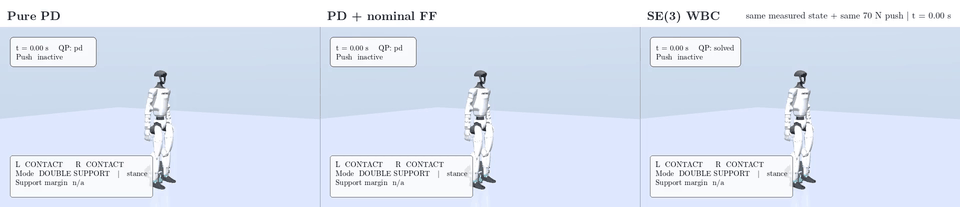
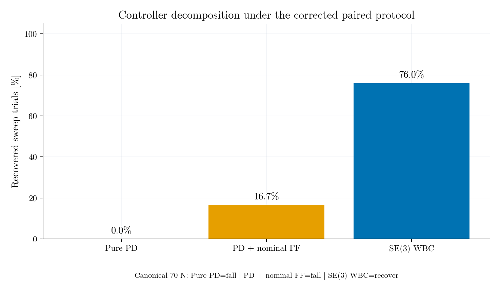
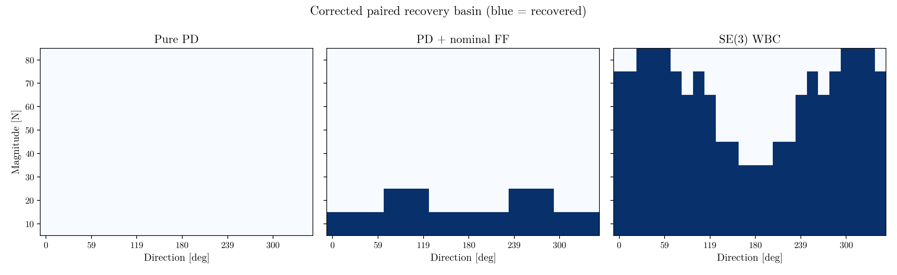
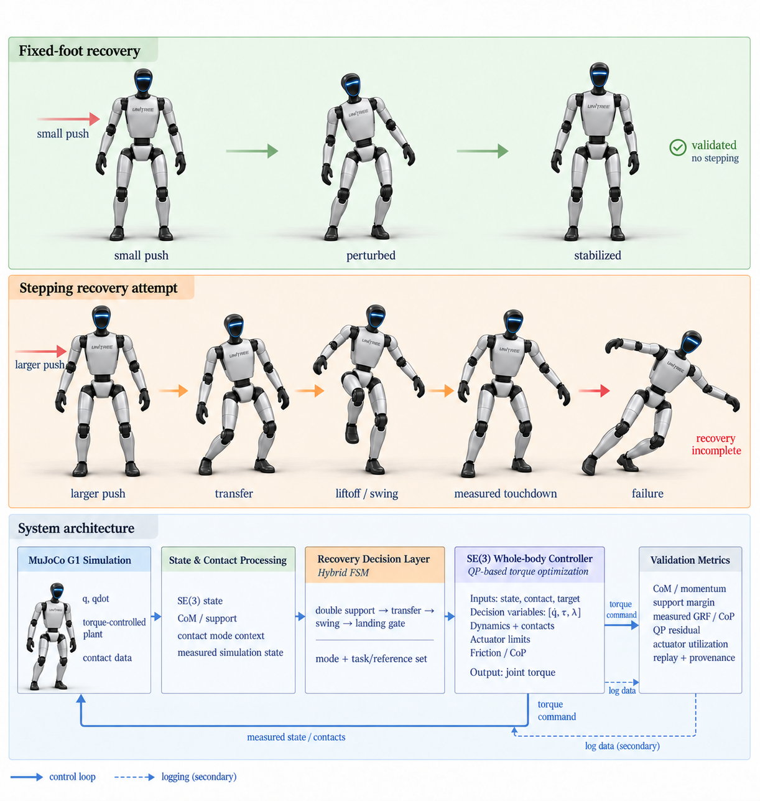

# SE(3) Whole-Body Control for Unitree G1

> A reproducible MuJoCo study of humanoid push recovery, packaged as an engineering portfolio.

This repository builds and measures a torque-level recovery stack for the
Unitree G1. The research question is deliberately narrow: under one shared
initial state and one shared disturbance, how much recovery comes from nominal
joint feedforward and how much comes from a contact-aware SE(3) whole-body QP?

  

  <strong>One measured state. One 70 N push. Three controllers.</strong> 
  <a href='results/revalidation/g1_paired_b114efb/videos/canonical_three_controller.mp4'>Download the H.264 video</a>
  &middot;
  <a href='results/revalidation/g1_paired_b114efb/summary.json'>Open the machine-readable summary</a>

## Project in one minute

- **Plant:** Unitree G1, 29 actuated DoF, floating pelvis, MuJoCo.
- **Control loop:** 2 ms physics, 4 ms controller, torque-only plant input.
- **Controller comparison:** `pure_pd`, `pd_nominal_ff`, and production fixed-foot `se3_wbc`.
- **Evidence:** 291 paired conditions and 873 trial rows across gates, canonical,
  calibration, sweep, and robustness stages.
- **Engineering principle:** make the comparison auditable before making it persuasive.

## Headline result

The corrected protocol settles once for 0.6 s with frozen nominal equilibrium
feedforward, snapshots the state, and starts all three controllers from that
same snapshot. The push is applied on the 2 ms physics grid and recovery is
accepted only inside the declared six-second post-push window.

| Controller | Canonical 70 N | Calibration | Sweep | Paired robustness |
|---|---:|---:|---:|---:|
| Pure PD | FALL | 0/48 (0.0%) | 0/192 (0.0%) | 0/50 (0.0%) |
| PD + nominal FF | FALL | 10/48 (20.8%) | 32/192 (16.7%) | 0/50 (0.0%) |
| SE(3) WBC | RECOVERED | 30/48 (62.5%) | 146/192 (76.0%) | 33/50 (66.0%) |

The canonical maximum torso error / horizontal CoM displacement / joint torque
are, respectively: Pure PD **1.8565 rad / 0.5731 m / 139.00 N m**,
PD + nominal FF **2.2135 rad / 0.3878 m / 139.00 N m**, and SE(3) WBC
**0.0506 rad / 0.0812 m / 20.27 N m**.

These are finite deterministic simulation results, not hardware or population
confidence claims. The historical legacy-protocol result remains unchanged:
32/192 for the old PD artifact and 145/192 for the old WBC artifact. The
corrected protocol reports 32/192 for the explicitly named nominal-FF
controller and 146/192 for WBC, without retuning.

## What was engineered

### Fair paired trials

`PairedInitialCondition` stores qpos, qvel, torso/pelvis targets, CoM and joint
references, seed, setup policy, and a SHA-256 state hash. `run_trial` rejects
legacy initial-state arguments when a paired condition is supplied and
re-anchors every controller to the saved references.

### Measured contact and timing

The simulator holds each control output for two 2 ms physics substeps. The
canonical 0.15 s pulse therefore produces exactly 75 active substeps and
10.5 N s realized impulse. Physical MuJoCo contact forces remain separate from
QP wrench predictions.

### Traceable artifacts

Every aggregate row carries source, config, model, initial-state, reference,
force-trace, dependency, duration, impulse, and classifier provenance. Full raw
trajectories stay in the execution archive; GitHub contains curated trajectories,
sanitized summaries, figures, video, and manifests.

## Visual evidence

All current static figures use the repository-owned **Latin Modern Roman**
faces from `assets/fonts/latin-modern/`; video overlays use the same bundled
faces. The main figures answer different engineering questions:

  
  

| Artifact | Purpose |
|---|---|
| [Controller decomposition](results/revalidation/g1_paired_b114efb/figures/controller_decomposition.png) | separates feedforward from whole-body optimization |
| [Recovery basin](results/revalidation/g1_paired_b114efb/figures/recovery_basin.png) | shows the measured magnitude/direction grid |
| [Paired outcome differences](results/revalidation/g1_paired_b114efb/figures/paired_outcome_differences.png) | exposes condition-level wins and shared failures |
| [Failure modes](results/revalidation/g1_paired_b114efb/figures/failure_modes.png) | keeps contact loss, fall, and slip visible |
| [Robustness comparison](results/revalidation/g1_paired_b114efb/figures/robustness_comparison.png) | compares the 50 common perturbed conditions |
| [Synchronized three-panel MP4](results/revalidation/g1_paired_b114efb/videos/canonical_three_controller.mp4) | saved-trajectory video; no re-simulation needed |

## System architecture

  

The implementation separates geometry, dynamics, contact constraints,
simulation, evaluation, and presentation. The WBC receives measured state and
post-step contacts; it does not receive the configured push as an oracle.

## Reproduce the benchmark

Requirements are Python 3.10+, MuJoCo 3.1 to 3.x, NumPy, SciPy, OSQP,
Matplotlib, Pillow, PyYAML, ImageIO, and pytest. Install from the project root:

~~~bash
python -m venv .venv
source .venv/bin/activate
python -m pip install -e '.[dev]'
export MUJOCO_GL=egl        # headless Linux only
python -m pytest -q
~~~

The staged benchmark commands are intentionally explicit and refuse to
overwrite an existing output root:

~~~bash
python experiments/paired_benchmark.py prepare --output-root results/revalidation/g1_paired_<source-short-sha>
python experiments/paired_benchmark.py gates --output-root results/revalidation/g1_paired_<source-short-sha>
python experiments/paired_benchmark.py canonical --output-root results/revalidation/g1_paired_<source-short-sha>
python experiments/paired_benchmark.py calibration --output-root results/revalidation/g1_paired_<source-short-sha>
python experiments/paired_benchmark.py sweep --output-root results/revalidation/g1_paired_<source-short-sha>
python experiments/paired_benchmark.py robustness --output-root results/revalidation/g1_paired_<source-short-sha>
~~~

Package figures and curated outputs only after the raw stages pass their
equality gates. `scripts/render_paired_comparison.py` renders the synchronized
video from saved trajectories; it does not run the controller again.

## Repository map

~~~text
src/se3_whole_body_control/
  geometry/       SO(3) and SE(3) frame-safe operations
  control/        PD and contact-constrained whole-body QP
  dynamics/       floating-base model and Jacobians
  simulation/     MuJoCo stepping, contacts, and logs
  evaluation/     classifier and trial metrics
  visualization/  Latin Modern style, plots, renderer, and video helpers
experiments/      benchmark and arena entry points
configs/          robot, controller, and experiment configuration
scripts/          packaging, rendering, verification, and provenance tools
models/unitree_g1/ pinned MJCF, meshes, mapping, and upstream terms
results/revalidation/g1_paired_b114efb/  curated corrected benchmark
results/revalidation/g1_6024ce9/         untouched historical baseline
tests/            geometry, contact, dynamics, and benchmark regression tests
~~~

## Provenance and scope

The corrected simulation source checkpoint is
`b114efb8e0170592b835344eb69ea6c3ce889c6f`. The published result root is
versioned by that source short SHA. The complete raw inventory is bound by the
[remote raw manifest](results/revalidation/g1_paired_b114efb/remote_raw_manifest.json);
the [curated manifest](results/revalidation/g1_paired_b114efb/curated_manifest.json)
verifies every promoted file.

This is a MuJoCo fixed-foot recovery study. It does not claim walking,
successful full stepping recovery, uneven-terrain robustness, perception,
hardware transfer, or hard real-time execution. The adaptive arena remains a
bounded prototype and its failure cases are intentionally retained.

The G1 asset is the torque-actuated 29-DoF Unitree model without dexterous
hands. See [models/unitree_g1/](models/unitree_g1/) for the pinned upstream
revision, mapping notes, and license. The bundled Latin Modern faces are
distributed under the GUST font license in
[assets/fonts/latin-modern/GUST-FONT-LICENSE.txt](assets/fonts/latin-modern/GUST-FONT-LICENSE.txt).

## Citation

~~~bibtex
@software{aimldlnlp_se3_g1_push_recovery,
  author  = {{aimldlnlp}},
  title   = {SE(3) Whole-Body Push Recovery for Unitree G1},
  year    = {2026},
  url     = {https://github.com/aimldlnlp/se3-humanoid-push-recovery}
}
~~~

The repository currently does not declare a separate top-level license for
project-owned source code. Check the repository owner's terms before
redistributing code or generated data; third-party assets retain their own
licenses.
