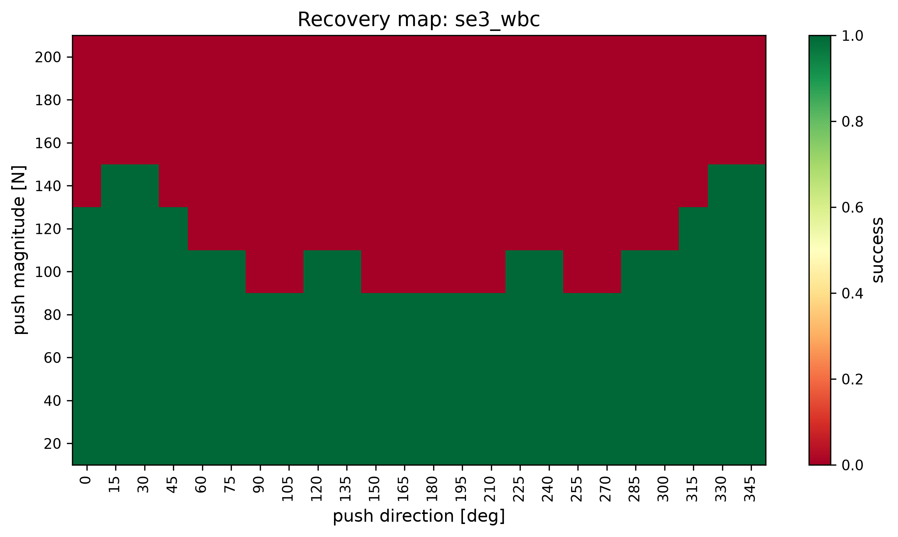
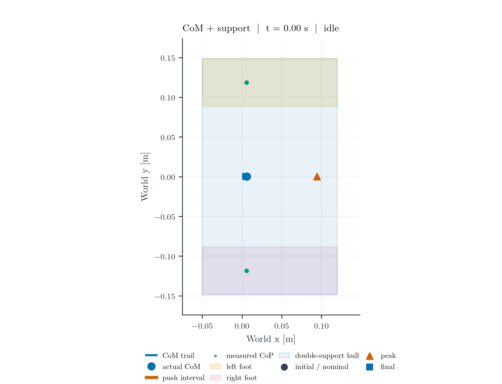

# SE(3) Humanoid Push Recovery

A fixed-foot floating-base humanoid uses SE(3) geometric pose-error resolved-acceleration tasks inside a contact-constrained whole-body QP, then measures the physical MuJoCo response to horizontal pushes.

```text
Geometry  ->  Control  ->  Physics  ->  Optimization  ->  Experimental evidence
```

## The problem in one view

The floating base is underactuated, both feet must preserve unilateral contact, and the feasible wrench is limited by friction and the finite support region. A controller that looks stable in joint coordinates can still request an impossible wrench, slip a foot, or leave the support polygon. This project compares a joint-space PD reference with a disturbance-unaware SE(3) whole-body QP under the same push and the same physical recovery classifier.




## Portfolio visual set




The static figures are available in both PNG and PDF: the canonical multi-panel response, actual ground-reaction forces, CoM/support polygon, controller comparison, and recovery heatmaps. The perturbed-standing response is available as `results/videos/perturbed_standing_recovery.gif` and `.mp4`.

## Technical contributions

- Explicit right-invariant spatial/world SE(3) convention with `[linear; angular]` twists, adjoint transforms, and production-task global-frame equivariance tests.
- Floating-base MuJoCo dynamics with body-COM Jacobians validated by finite differences.
- OSQP whole-body QP with dynamics, fixed-foot acceleration, torque, acceleration, friction, support-polygon CoP, and torsional-wrench constraints.
- Separate QP-predicted contact wrench and actual MuJoCo ground-reaction wrench.
- Controller-independent physical foot-slip detection from actual tangential velocity, XY displacement, and friction utilization.
- Measured foot support vertices, active double-support convex hull, and contact CoP visualization.
- Recovery metrics with explicit `recovered_at_s` and `recovery_latency_s`, where latency is measured after the push ends.
- Deterministic push-basin measurements plus genuinely seed-randomized robustness trials.

## SE(3) convention

For every body, `T_world_body` maps body coordinates to world coordinates. The production controller uses a right-invariant spatial/world error:

```text
E_s      = T_world_current @ inverse(T_world_desired)
xi_error = Log(E_s)^vee
```

`Log(E_s)^vee` and the MuJoCo body Jacobian are both spatial/world twists:

```text
twist_world = J_world(q) @ qdot
xi          = [v_x, v_y, v_z, omega_x, omega_y, omega_z]
```

The proportional and derivative gains are specified in the desired-body tangent frame and transported with the desired-pose adjoint. Therefore, for a constant global frame change `G`, the production task follows `E_s' = G E_s G^-1`, `xi' = Ad_G xi`, and the task acceleration/output transforms consistently. This is tested through `pose_task_acceleration`, not only through isolated SE(3) identities. The implementation exposes `hat/vee`, SO(3)/SE(3) exponential and logarithm maps, composition, inverse, and adjoint operations in `src/se3_whole_body_control/geometry/`.

This is a geometric pose-error resolved-acceleration task embedded in a contact-constrained whole-body QP. It is not presented as a globally exact nonlinear tracking law or a formal stability guarantee.

## Robot, contacts, and physics

The repository contains a self-contained MuJoCo model with a floating base, pelvis, torso, two articulated legs, two foot contact geoms, actuators, and a ground plane. The simulation uses a 0.002 s physics step and 0.004 s control step.

The CoM Jacobian is built from the actual body COM positions using `mj_jacBodyCom`; a finite-difference test verifies:

```text
p_dot_CoM ~= J_CoM(q) @ qdot
```

For every foot, the evaluator extracts actual contact forces with `mj_contactForce`, transforms each contact wrench into world coordinates, and sums the wrench about the foot body COM. These physical measurements are never substituted by the QP variable. The evaluator also records foot tangential speed, XY displacement, friction utilization, measured CoP, support vertices, contact flags, and predicted-vs-actual friction margins.

The external push is applied at a body-local point only after rotating that point into world coordinates. The primary controller does not receive an oracle copy of the push: `use_external_force_oracle: false`.

## Whole-body QP

The decision variable is:

```text
x = [qdd, tau, lambda_left, lambda_right]
```

The hard model constraints are:

```text
M(q) qdd + h(q, qdot) = B tau + Jc.T lambda
Jc qdd + Jdot qdot = 0
Fz >= 0
|Fx| <= mu Fz,  |Fy| <= mu Fz
|Mx| <= y_support Fz,  |My| <= x_support Fz
|Mz| <= mu_torsion Fz
tau_min <= tau <= tau_max
qdd_min <= qdd <= qdd_max
```

The support limits come from the configured foot rectangle, rather than arbitrary large moment bounds. A high-penalty, explicitly logged contact slack is available for numerical feasibility; constraints are not silently removed. Each solve records OSQP status, timing, residuals, torque, predicted wrench, slack, and friction margin.

## Evaluation protocol

Recovery requires all of the following for the configured stable interval: torso orientation error below 0.0873 rad, torso angular velocity below 0.15 rad/s, horizontal CoM displacement below 0.10 m, valid double support, no torso-ground impact, and no physical slip event. The implemented failure labels are `FALL`, `SLIP`, `CONTACT_LOSS`, and `TIMEOUT`.

Quiet standing is only a sanity check. Perturbed standing settles the nominal model, applies the configured initial torso tilt/CoM offset/angular velocity, and then starts logging at `t=0`; no PD warmup is allowed to erase the disturbance. Push recovery uses a 120 N, 0 deg, 0.15 s torso push starting at 2.0 s.

## Measured results from the frozen run

All final data, figures, and videos were regenerated from source checkpoint `3be7824` on the SSH MuJoCo environment. The canonical run uses the exact same disturbance for both controllers and no push-force oracle.

| trial | success | recovered at | recovery latency | max torso error | max CoM displacement | max torque | max measured Fz |
|---|---:|---:|---:|---:|---:|---:|---:|
| PD | yes | 3.112 s | 0.962 s | 0.174 rad | 0.074 m | 21.70 Nm | 1396.9 N |
| SE(3) WBC | yes | 3.876 s | 1.726 s | 0.162 rad | 0.086 m | 20.66 Nm | 1269.2 N |

This is not tuned into a one-sided victory: WBC reduces the canonical peak torque and peak orientation error, while PD recovers sooner and has smaller CoM displacement in this run. WBC actual friction utilization reaches 1.00 and its minimum actual friction margin is approximately 0.0. The actual contact traces are in `results/data/single_push_se3_wbc.npz` and the flagship figure.

Canonical WBC QP timing was mean 1.835 ms, p95 2.233 ms, p99 3.050 ms, and maximum 30.911 ms. Against the explicit 4 ms control deadline, 0.267% of logged solves exceeded the deadline. This is an offline timing measurement; the project makes no hard-real-time claim.

The full deterministic basin contains 10 magnitudes from 20-200 N, 24 directions, and both controllers:

- PD: 96/240 successful trials (40.00%); failures were 63 `FALL`, 41 `CONTACT_LOSS`, and 40 `SLIP`.
- SE(3) WBC: 122/240 successful trials (50.83%); failures were 60 `FALL`, 50 `CONTACT_LOSS`, and 8 `SLIP`.

The largest successful magnitude in this grid was 120 N for PD and 140 N for WBC. These are measured basin boundaries for this compact model, not general guarantees.

The corrected perturbed-standing run records the intended initial state: 0.0167 rad torso error, 0.00151 m CoM displacement, and 0.000764 rad/s torso angular velocity. PD then failed by measured `SLIP`; WBC failed by `CONTACT_LOSS`. Peak measured GRFs were 7422.2 N and 7743.4 N respectively. The failure is reported because direct initialization exposes the disturbance instead of allowing warmup to hide it.

The robustness study contains 50 WBC trials: friction values 0.3/0.5/0.7/0.9, mass scales 0.9/1.0/1.1, and push durations 0.10/0.15/0.20 s, each with seeds 0-4. Each seed changes the initial perturbation and push magnitude/direction. These are known plant/controller parameter sweeps, not hidden-model uncertainty; a separate true-plant/internal-model mismatch experiment is not claimed here.

## Reproduction

Install the local developer environment:

```powershell
py -3.12 -m venv .venv
.\.venv\Scripts\Activate.ps1
python -m pip install -r requirements.txt
python -m pip install -e .
pytest -q
```

Run the experiments from the repository root:

```powershell
python experiments/phase1_simulation.py
python experiments/standing.py
python experiments/perturbed_standing.py
python experiments/single_push.py
python experiments/compare_baseline.py
python experiments/push_sweep.py
python experiments/robustness.py
python scripts/generate_figures.py
python scripts/run_demo.py
python scripts/render_comparison_video.py
python scripts/render_geometry_animation.py
python scripts/render_com_support_animation.py
python scripts/render_perturbed_standing.py
```

Long MuJoCo runs and headless rendering are intended for the configured SSH worker. The repository includes `scripts/remote_sync.ps1` for source/results transfer and `scripts/remote_run.ps1` for remote experiment entry points. Every trial writes configuration, seed, hostname, timestamp, run ID, and source version metadata.

## Repository structure

```text
configs/       robot, controller, and experiment thresholds
models/        self-contained humanoid XML and attribution
src/           geometry, dynamics, control, disturbance, evaluation, visualization
experiments/   standing, push, sweep, robustness, and comparison entry points
scripts/       synchronization, rendering, plotting, and provenance helpers
tests/         production geometry, CoM, dynamics, contact, push, QP, and recovery tests
results/       measured data, PNG/PDF figures, videos, and execution logs
```

## Limitations

The study is fixed-foot double support on a compact self-contained MuJoCo model. It does not claim stepping, walking, reinforcement learning, perception, hardware transfer, or a formal recovery guarantee. Contact impulses can be high around impact because the model is small and rigid; actual GRFs are reported so this limitation is visible. Future work can add hybrid stepping modes, true plant/controller mismatch, payload changes, and hardware validation without changing the core SE(3) evaluation convention.
