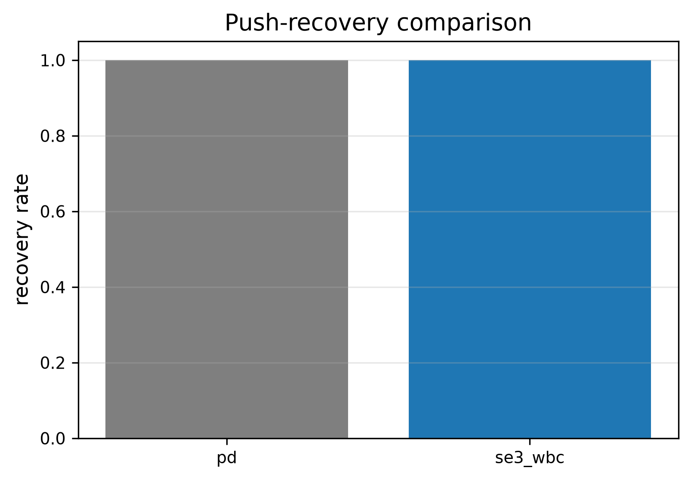

# SE(3) Geometric Whole-Body Control for Humanoid Push Recovery

This repository implements a model-based humanoid push-recovery benchmark using Lie-group pose errors on SE(3), floating-base dynamics, fixed-foot contact constraints, and a contact-constrained quadratic program (QP). The local checkout is the canonical source; long simulations and parameter sweeps run on the configured SSH worker.

## Status

The project is built in phase gates. Results in `results/` are generated by the reproducible commands below and are never hand-edited. The current implementation includes a self-contained MuJoCo humanoid model, SO(3)/SE(3) geometry, a joint-space PD reference, a contact-constrained OSQP whole-body controller, push disturbances, recovery metrics, plots, video rendering, and remote execution helpers.




## Quick start

Create a local CPU environment and install the project:

```powershell
py -3.12 -m venv .venv
.\.venv\Scripts\Activate.ps1
python -m pip install -r requirements.txt
python -m pip install -e .
pytest -q
python experiments/standing.py
python experiments/single_push.py
python scripts/run_demo.py
```

For heavy runs, use the remote worker after configuring SSH:

```powershell
.\scripts\remote_run.ps1 -Experiment single_push -PullResults
.\scripts\remote_run.ps1 -Experiment push_sweep -PullResults
```

## Problem

The system studies how much horizontal torso disturbance a double-support humanoid can reject while keeping both feet fixed. The primary comparison is joint-space PD versus a geometric whole-body controller.

## Why SE(3)?

The torso and pelvis errors are represented with the matrix logarithm on SE(3):

```text
xi_e = log(T_desired^-1 T_current)^vee
```

The twist convention is `[v_x, v_y, v_z, omega_x, omega_y, omega_z]`, with world-frame linear and angular Jacobians. This avoids Euler-angle singularities and makes the frame convention explicit.

## System model and controller

The model is a compact, self-contained floating-base humanoid with a box torso, pelvis, two four-joint legs, feet, and a ground plane. MuJoCo supplies forward dynamics, mass matrix, body Jacobians, contacts, and actuator dynamics.

Each measured trial first runs a common 0.4 s gravity-compensated PD settling warm-up, re-anchors both controllers at the settled state, and resets experiment time. This removes an artificial plane-boundary collision and gives the baseline and WBC identical initial conditions.

The QP decision variable is:

```text
x = [qdd, tau, lambda]
```

The controller enforces floating-base dynamics, fixed-foot acceleration constraints, torque/acceleration bounds, and a friction pyramid. A small, explicitly penalized contact-constraint slack is logged to expose numerical infeasibility rather than dropping constraints. Soft objectives regulate torso orientation, torso translation, pelvis pose, center of mass, nominal posture, acceleration, and torque. OSQP status and residuals are logged on every control step.

## Push disturbance and recovery criteria

Pushes are constant horizontal forces with configurable magnitude, direction, start time, duration, body, and optional local application point. Recovery requires bounded torso orientation and angular velocity, bounded CoM displacement, maintained foot contacts, and a stable interval before timeout. Failure modes are recorded rather than hidden.

## Reproducing experiments

```powershell
python experiments/standing.py
python experiments/single_push.py
python experiments/compare_baseline.py
python experiments/push_sweep.py
python experiments/robustness.py
python experiments/gpu_benchmark.py
python scripts/generate_figures.py
python scripts/render_video.py
```

The default sweep is deterministic. Long sweep and video commands are intended for the SSH worker. All run metadata is saved under `results/logs/`.

## Measured results

The completed 480-trial sweep contains 10 push magnitudes from 20--200 N,
24 directions, and both controllers. On this compact model and the configured
thresholds, joint-space PD recovered 122/240 trials (50.83%) and SE(3) WBC
recovered 99/240 trials (41.25%). The dataset records `FALL`,
`CONTACT_LOSS`, `SLIP`, and `TIMEOUT`; the WBC is not claimed to be superior
because this measured sweep does not support that claim.

The canonical 120 N, 0 degree, 0.15 s push recovered for both controllers.
Measured recovery times were 3.112 s for PD and 3.092 s for SE(3) WBC. The
WBC maximum torso rotation error was 0.1418 rad and maximum CoM displacement
was 0.0759 m.

The demo requests the configured 1920x1080 headless framebuffer, selects EGL
automatically on a Linux worker without `DISPLAY`, and records the actual
resolution and any fallback reason in `results/logs/video_render.txt`. The
current worker produced the requested 1920x1080 H.264 output.

The 50-trial one-factor robustness study recovered all friction cases
(mu=0.3, 0.5, 0.7, 0.9), all mass-scale 1.0 trials, and 0.10/0.15 s push
duration cases. Mass scales 0.9/1.1 and 0.20 s pushes failed in this setup;
raw rows and failure reasons are in `results/data/robustness.csv`.

## CPU/GPU

CPU MuJoCo is the reference path and is required for completion. The remote
RTX A5000 was visible to `nvidia-smi`, but the isolated project environment did
not have JAX/MJX installed, so the recorded GPU benchmark is `unavailable`
(`ModuleNotFoundError: No module named 'jax'`). No GPU speedup is claimed.

## Repository structure

```text
configs/       YAML experiment parameters
models/        self-contained humanoid XML and attribution
src/           library implementation
experiments/   reproducible experiment entry points
scripts/       demo, plotting, video, and SSH helpers
tests/         geometry, contacts, pushes, metrics, and smoke tests
results/       generated data, figures, videos, and logs
```

## Limitations and future work

The core scope is fixed-foot double support. It does not claim stepping recovery, hardware validation, or theoretical recovery guarantees. Natural extensions are hybrid contact modes, stepping, payloads, uncertainty compensation, and a hierarchical QP.
