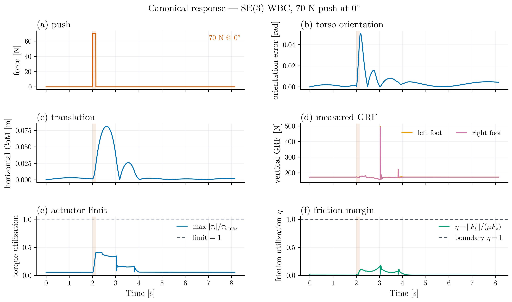
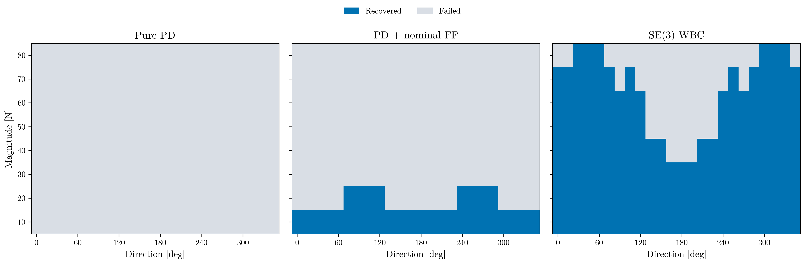
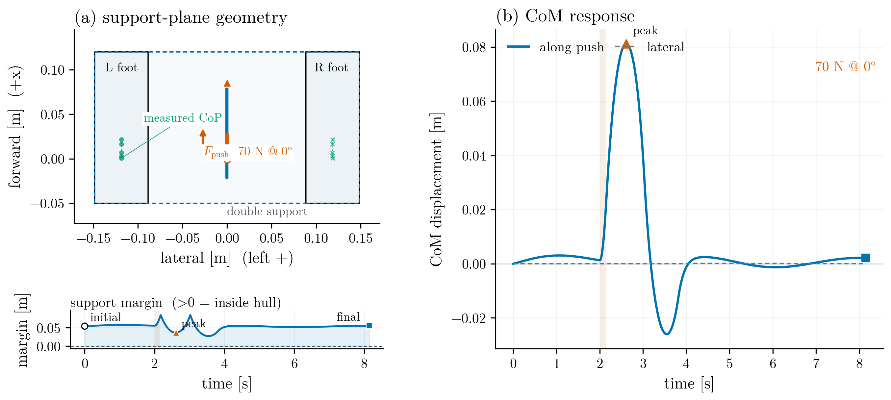

# SE(3) Humanoid Push Recovery

SE(3) geometric pose-error resolved-acceleration tasks embedded in a contact-constrained whole-body QP, evaluated on a floating-base Unitree G1 in MuJoCo.

The problem is fixed-foot balance under an unmeasured torso push. Geometry supplies the task error, optimization distributes acceleration/torque/contact predictions, and MuJoCo determines the actual ground reaction. No stepping or disturbance oracle is used in the primary comparison.

https://github.com/user-attachments/assets/219f1802-cab5-401b-a59f-0e4d30c8adbe

[Watch the synchronized H.264 comparison](results/revalidation/g1_paired_a500081/videos/canonical_three_controller.mp4) · [Measured results](results/revalidation/g1_paired_a500081/summary.json)

## Measured result

All current results use frozen scientific source `a50008145b0b47d4b874002bd656355cb14687de`. Gains, pushes and recovery thresholds were not tuned for this release. A numerical correctness fix rejects solver outputs that violate original, unscaled constraint rows, even when OSQP reports `solved`.

| Controller | Canonical 70 N | Recovery latency | Peak torso error | Peak CoM displacement | Peak joint torque |
|---|---|---:|---:|---:|---:|
| Pure PD | FALL | — | 1.8565 rad | 0.5731 m | 139.00 N m |
| PD + nominal FF | FALL | — | 2.2135 rad | 0.3878 m | 139.00 N m |
| SE(3) WBC | RECOVERED | 0.270 s | 0.0506 rad | 0.0812 m | 20.27 N m |

**Baseline qualification:** Pure PD also falls in the no-push standing sanity check. It is a feedforward-removal ablation, not a viable standing baseline. Its zero recovery rate must not be interpreted as a push-only effect. PD + nominal FF stands without push; the meaningful primary recovery comparison is PD + nominal FF versus SE(3) WBC.

| Controller | Calibration | Push sweep | Known-parameter robustness |
|---|---:|---:|---:|
| Pure PD (ablation) | 0/48 (0.0%) | 0/192 (0.0%) | 0/50 (0.0%) |
| PD + nominal FF | 10/48 (20.8%) | 32/192 (16.7%) | 0/50 (0.0%) |
| SE(3) WBC | 30/48 (62.5%) | 146/192 (76.0%) | 33/50 (66.0%) |

These headline outcomes match the historical paired benchmark at reported precision. This release is **not presentation-only**: numerical acceptance changed, all experiments were regenerated, and the larger mismatch study is new.



Orange shading marks the measured push interval. GRF is **actual MuJoCo contact force**, not the QP wrench. Spikes are retained. Torque and friction utilization are dimensionless, with physical boundaries at 1.0.



Each cell is measured, not interpolated. The [recovery envelope](results/revalidation/g1_paired_a500081/figures/recovery_envelope.png) reports the largest *tested* recovered magnitude; it is not proof of a continuous stability boundary.

## Method

The G1 has 29 actuated joints and a floating pelvis. Physics runs at 2 ms; commands are held for 4 ms. The controller receives measured state, not an oracle copy of the push. Only actuator torques are sent to the plant.

### SE(3) convention

Poses map body coordinates into world coordinates. Production uses the **right-invariant spatial/world error**, translation first:

$$
E_s=T T_d^{-1}, \qquad \xi_e=\operatorname{Log}(E_s)^\vee
=[v_x,v_y,v_z,\omega_x,\omega_y,\omega_z]^T.
$$

The MuJoCo body-point Jacobian is converted to a spatial-twist Jacobian in the same world tangent frame. Desired-body tangent gains are transported with the desired pose adjoint:

$$
K_{p,s}=\operatorname{Ad}_{T_d}K_{p,d}\operatorname{Ad}_{T_d}^{-1},\qquad
a_s^*=-K_{p,s}\xi_e-K_{d,s}J_s\dot q.
$$

The production pose-task test exercises equivariance under a rigid change of world frame. This is a resolved-acceleration approximation, **not** a globally exact nonlinear tracking law or stability proof. The mass-weighted CoM Jacobian uses `mj_jacBodyCom` and is finite-difference tested.

### Whole-body QP and contacts

Variables are generalized acceleration, actuator torque, per-foot world wrench, and penalized contact-acceleration slack:

$$
x=[\ddot q,\tau,\lambda,s],\qquad M(q)\ddot q+h(q,\dot q)=B\tau+J_c^T\lambda,
$$

$$
J_c\ddot q+\dot J_c\dot q+s=0.
$$

Torso/pelvis pose, CoM, posture, acceleration and torque objectives share the QP. Slack is explicitly logged: a small residual of this *slack-containing equation* does not imply zero physical foot acceleration.

The horizontal friction approximation is conservative:

$$
F_z\ge0,\qquad |F_x|+|F_y|\le\mu F_z.
$$

This world-XY L1 diamond lies inside the Coulomb circle. Rectangular CoP bounds constrain $M_x=yF_z$ and $M_y=-xF_z$; torsional friction is bounded too. This is a flat-patch approximation, not an exact distributed contact wrench cone for arbitrary terrain or foot orientation.

Predicted and measured wrenches remain separate. The [wrench consistency diagnostic](results/revalidation/g1_paired_a500081/figures/contact_wrench_consistency.png) shows their discrepancy.

### Numerical acceptance

OSQP's scaled global stopping criterion does not certify each physical constraint. Production checks every original row against its own absolute-plus-relative budget. A violation receives **one tighter numerical retry of the same QP**; persistent violations are rejected with an explicit fallback message. Wrenches are not clipped to hide violations.

The [contact audit](results/revalidation/g1_paired_a500081/contact_audit.json) retains force-unit excesses, the strict 1 mN check, engineering-budget ratios, refinement counts and solver failures. This does not relax the physical classifier. Workspace reuse stays off in primary runs; the previous warm-start pilot is historical diagnostic evidence only.

## Experiments

### Fair comparison and recovery

A shared 0.6 s setup produces saved state and references. Every triplet receives identical qpos, qvel, targets and force traces. The canonical push is 70 N at 0°, lasting 0.15 s from 2.0 s: 75 physics substeps and 10.5 N s impulse.

There are 291 pushed conditions / 873 controller trials, plus six quiet/perturbed-standing sanity trials. The separate mismatch study adds 80 WBC trials. All CSV rows and per-trial summaries remain available, including failures.

PD and WBC use the same physical recovery criteria: torso error below 5°, angular velocity below 0.15 rad/s and horizontal CoM displacement below 0.10 m, held for 0.25 s within six seconds after the push. Fall, sustained contact loss/slip, actuator/joint limits, numerical failure and QP failure can disqualify a trial.

Slip uses measured tangential foot velocity, contact displacement and actual friction utilization. YAML thresholds are unchanged. `recovered_at_s` is the first sample of a subsequently confirmed stable interval:

$$
\text{recovery latency}=t_{\mathrm{recovered}}-t_{\mathrm{push,end}}.
$$



The support region is the convex hull of active foot vertices. CoM projection margin is a geometric diagnostic, not a dynamic viability certificate.

### Standing and robustness

Quiet standing is a sanity check. Perturbed standing injects a contact-preserving angular-rate perturbation **after** setup; no PD warmup erases it before WBC starts.

Both PD + nominal FF and WBC retain double support throughout the 3 s quiet/perturbed checks. The initial perturbed torso angular speed is 0.05098 rad/s for all controllers; peak orientation errors are 0.02821 rad (PD + FF) and 0.00328 rad (WBC). This small perturbation is already inside the recovery band, so its classifier latency is not a meaningful settling-time benchmark.

The 50-condition three-controller robustness study varies friction, mass and duration with five genuinely randomized seeds. This is a **known-parameter sweep**, not model uncertainty.

The separate 80-trial mismatch diagnostic pairs known and nominal internal models on the same plant, state and randomized force trace: mass scales 0.9/1.1 or friction 0.3/0.5, longitudinal/lateral nominal 70 N pushes, five seeds. Unknown models retain nominal mass/friction. This is a WBC model-knowledge comparison, not a claim of universal superiority over PD.

Known models recover **24/40 (60.0%)** and nominal/unknown models **26/40 (65.0%)**. Among the 40 knowledge pairs, 22 both recover, 12 both fail, 2 recover only with known parameters and 4 only with the nominal model. Known-only wins occur in low-friction lateral pushes; nominal-only wins occur at mass scale 0.9. This small study does not establish universal benefit from either model-knowledge mode.

Canonical WBC solve timing on the shared CPU worker is **mean 3.771 ms, p95 6.523 ms, p99 6.823 ms, max 37.399 ms**. The control deadline is **4 ms**, missed by **22.13%** of calls. These are wall-clock measurements from this run, not a replicated runtime benchmark or a hard-real-time claim.

Across all 373 WBC trajectories, every accepted prediction passes the declared force budget and the strict 1 mN audit: maximum L1 excess **0.000999 N**. The log retains **77,281 numerical retries** and **86 rejected solves**. Failure trials and fallback calls are not removed.

[Actual GRF](results/revalidation/g1_paired_a500081/figures/actual_ground_reaction_forces.png) · [Physical slip](results/revalidation/g1_paired_a500081/figures/contact_slip_diagnostics.png) · [QP timing](results/revalidation/g1_paired_a500081/figures/qp_timing_diagnostics.png)

## Limitations

- Fixed-foot double support on flat ground; no walking, hardware transfer or general locomotion claim.
- Conservative L1/rectangular-patch contact approximation; predicted and measured forces differ.
- Contact acceleration uses explicit, heavily penalized slack.
- Shared-worker CPU timings are not hard-real-time measurements; 4 ms deadline misses are retained.
- Finite grids and five-seed diagnostics do not establish population robustness or nonlinear stability.
- Historical arena/stepping prototypes remain outside this benchmark and its claims.

## Reproduction

Install Python 3.10+ and the declared dependencies. Exact final package versions are recorded in the manifests.

```bash
python -m venv .venv
source .venv/bin/activate
python -m pip install -e '.[dev]'
export MUJOCO_GL=egl  # headless Linux only
export OPENBLAS_NUM_THREADS=1 OMP_NUM_THREADS=1
python -m pytest -q
```

Use science checkout `a50008145b0b47d4b874002bd656355cb14687de`. Each stage refuses existing output:

```bash
OUT=results/staging/reproduction
python experiments/paired_benchmark.py prepare --output-root "$OUT"
python experiments/paired_benchmark.py gates --output-root "$OUT"
python experiments/paired_benchmark.py canonical --output-root "$OUT" --workers 8
python experiments/paired_benchmark.py calibration --output-root "$OUT" --workers 8
python experiments/paired_benchmark.py sweep --output-root "$OUT" --workers 8
python experiments/paired_benchmark.py robustness --output-root "$OUT" --workers 8
python experiments/paired_benchmark.py mismatch --output-root "$OUT" --workers 8
python scripts/audit_contact_residuals.py --raw-root "$OUT/raw" --output "$OUT/contact_audit.json"
```

After the scientific stages finish, use presentation checkout `5428497a3af6b299819a39736cffaab511fd6256` (or the final release), keeping the same raw output directory:

```bash
python scripts/render_paired_comparison.py --data-root "$OUT" --output results/staging/comparison.mp4
python scripts/package_paired_benchmark.py --raw-root "$OUT" --output-root results/staging/publication --video results/staging/comparison.mp4 --trajectory-limit 8
python scripts/verify_paired_artifacts.py --root results/staging/publication
```

Video samples saved trajectories by timestamp at 30 FPS; rendering does not rerun dynamics. The synchronized H.264 video is 1920×1080, 245 frames, approximately 8.167 s, matching the 8.152 s simulated sample span to video-frame precision.

Presentation checkpoint `5428497a3af6b299819a39736cffaab511fd6256` corrects CFF font embedding, rounds angular tick labels, and improves camera/overlay readability; simulation/control/evaluation source remains `a500081`. Important figures have PNG/PDF exports. Bundled Latin Modern faces are embedded as vector glyph programs rather than invalid TrueType wrappers; text/lines are not rasterized.

## Provenance and repository

[Summary](results/revalidation/g1_paired_a500081/summary.json) · [Raw inventory](results/revalidation/g1_paired_a500081/remote_raw_manifest.json) · [Curated hashes](results/revalidation/g1_paired_a500081/curated_manifest.json) · [Verification](results/revalidation/g1_paired_a500081/verification.json)

Full raw trajectories remain in the worker archive. GitHub retains canonical/standing NPZs and up to eight deterministically selected conditions per noncanonical stage, with **all** CSV rows and sanitized JSON summaries. Large NPZ/MP4 files use Git LFS; credentials, environments, staging and temporary frames are ignored.

CSV `trial_summary_path` addresses the original raw inventory. Its public sanitized counterpart is `trial_summaries/<stage>/<trial_id>.json`.

Source is under `src/se3_whole_body_control/`; experiments, configs and tests are versioned. Previous `g1_paired_b114efb` and `contact_audit_eaef962` remain historical evidence, not current benchmark results.

See [model attribution](models/unitree_g1/UPSTREAM.md) and the [GUST font license](assets/fonts/latin-modern/GUST-FONT-LICENSE.txt). Project-owned source has no separate top-level license declared; check the owner's terms before redistribution.

```bibtex
@software{aimldlnlp_se3_g1_push_recovery,
  author = {{aimldlnlp}},
  title = {SE(3) Whole-Body Push Recovery for Unitree G1},
  year = {2026},
  url = {https://github.com/aimldlnlp/se3-humanoid-push-recovery}
}
```
