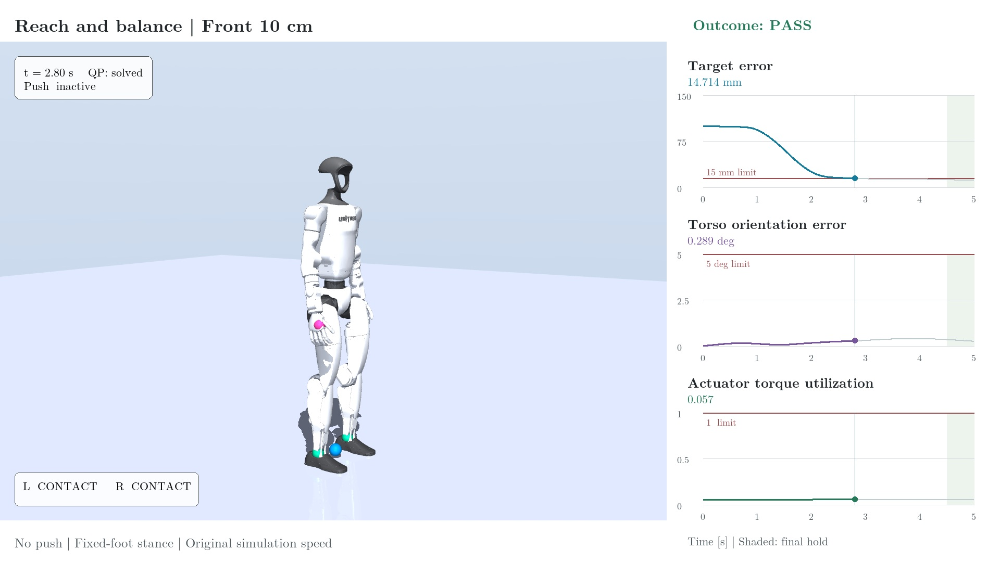

# SE(3) Humanoid Push Recovery

Whole-body balance and Cartesian reaching for a Unitree G1 humanoid in MuJoCo.
The robot responds to torso pushes without stepping or measuring the applied disturbance.

## Push Recovery

https://github.com/user-attachments/assets/219f1802-cab5-401b-a59f-0e4d30c8adbe

Three controllers, the same initial state, and the same 70 N push.
SE(3) whole-body control recovers in **0.270 s** in this standing benchmark.
PD with nominal feedforward falls; pure PD is an ablation that also fails the no-push standing check.

[Watch or download the comparison](assets/demos/push-recovery.mp4)

## Reach and Balance

[](assets/demos/reach-and-balance.mp4)

**Watch:** front 5 cm, front 10 cm, and front 12.5 cm, with live target error,
torso orientation error, and actuator torque utilization alongside the robot.
The first two pass. The last stays upright but misses the 15 mm hold tolerance.
All three are no-push trials, replayed at their original speed.

[Watch or download the 15-second demo](assets/demos/reach-and-balance.mp4)

## Engineering Highlights

- **Geometric control:** SE(3) pose errors drive torso and pelvis acceleration tasks.
- **Whole-body optimization:** a contact-constrained QP coordinates joint torque, balance, and reaching.
- **Physical limits:** friction, support geometry, actuator limits, and contact slack are audited.
- **Measured evaluation:** saved trajectories retain actual contacts, slip, tracking errors, and failures.

## Results at a Glance

| Evaluation | Result |
|---|---|
| Standing push sweep | WBC recovers in 146/192 tested conditions |
| Reaching with default weights | Front 5/10 cm and right 5 cm pass without a push |
| Small-target reaching under pushes | 7/8 tested motion/hold conditions pass both tasks |
| Higher reach authority | Better accuracy, but front 12.5 cm falls under both tested 70 N pushes |

This is a simulation project with fixed-foot double support, not a hardware or walking demonstration.
Larger disturbed reaches remain unresolved; neither experimental balance guard qualifies.
The sampled results do not establish a complete workspace or hard-real-time performance.

## Run a Demo

Python 3.10+ and FFmpeg are required for video output. From the repository root:

```bash
python -m pip install -e ".[dev]"
python scripts/run_demo.py
python experiments/reach_and_balance.py --output results/staging/my-reach --render
```

The standing and reaching commands run separate demos.
Use `MUJOCO_GL=egl` for headless Linux rendering. Run tests with `python -m pytest -q`.

## Explore Further

- [Methods, benchmark results, and reproduction](docs/EXPERIMENTS.md)
- [Demo rendering and source data](docs/DEMO_MEDIA.md)
- [Controller implementation](src/se3_whole_body_control/control/whole_body_qp.py)
- [Unitree model attribution](models/unitree_g1/UPSTREAM.md)

Built with Python, MuJoCo, NumPy, SciPy, and OSQP.
Project-owned code has no separate top-level license declared; consult the owner before redistribution.
