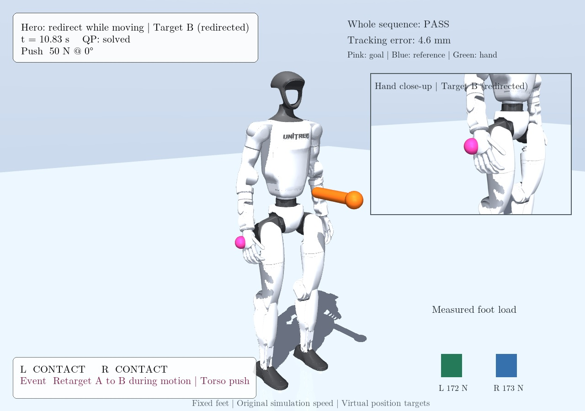

# SE(3) Humanoid Push Recovery

Whole-body balance and Cartesian reaching for a Unitree G1 humanoid in MuJoCo.
The robot responds to torso pushes without stepping or measuring the applied disturbance.

## Push Recovery

https://github.com/user-attachments/assets/8b018443-40a3-459c-bd7f-f22a180eab8c

Three controllers, the same initial state, and the same 70 N push.
SE(3) whole-body control recovers in **0.270 s** in this standing benchmark.
PD with nominal feedforward falls; pure PD is an ablation that also fails the no-push standing check.

[Watch or download the comparison](assets/demos/push-recovery.mp4)

## Reach and Balance

https://github.com/user-attachments/assets/d540ef49-2f4c-4b0d-a001-3d5191d51d9d

**Same 12.5 cm target, same 70 N push during hold.** The contact-corrected
predecessor falls; correcting pose-origin and acceleration conventions recovers
balance with a maximum final-hold hand error of **4.804 mm** against a 15 mm limit.
The third panel changes the push direction to show a known lateral-slip failure.
Live target distance, CoM displacement, foot drift, and torque utilization stay
synchronized with the robot at original simulation speed.

[Watch or download the comparison](assets/demos/reach-before-after.mp4)

## Reactive Multi-Target Reaching

One 16-second sequence: reach A, follow B and C, then redirect toward B while
the hand is still moving. A 50 N torso push for 0.15 s interrupts the final
transition. Target labels and a hand close-up make the task changes visible;
the video replays saved states at original simulation speed.

[](results/reactive_reaching/20261007_timing/simultaneous/media/reactive-reaching.mp4)

[Watch or download the 16-second progression](results/reactive_reaching/20261007_timing/simultaneous/media/reactive-reaching.mp4)

**Timing matters: two of three tested push times pass.** Retargeting occurs at
10.80 s. The same sequence falls when the push starts at 10.55 s; starts at
10.80 and 11.05 s pass. All three retain the same initial state, references,
gains, physical thresholds, and 7.5 N·s impulse. The broader timing gate fails,
so this remains a bounded demo, not general reactive recovery.

[Timing study and retained failure](results/reactive_reaching/20261007_timing/REPORT.md) ·
[Original nominal and hero pilot](results/reactive_reaching/20261006_pilot/REPORT.md)

## Engineering Highlights

- **Geometric control:** SE(3) pose errors drive torso and pelvis acceleration tasks.
- **Whole-body optimization:** a contact-constrained QP coordinates joint torque, balance, and reaching.
- **Physical limits:** friction, support geometry, actuator limits, and contact slack are audited.
- **Measured evaluation:** saved trajectories retain actual contacts, slip, tracking errors, and failures.
- **Root-cause debugging:** frozen-state replays separate task-convention errors,
  contact-model mismatch, and numerical constraint violations from gain tuning.

## Results at a Glance

| Evaluation | Result |
|---|---|
| Standing push sweep | WBC recovers in 146/192 tested conditions |
| Corrected 12.5 cm reaching pilot | Nominal, moving-push, and held-target push all pass |
| Broader reaching disturbance check | 5/9 tested conditions pass, including the repeated positive control |
| Reactive reaching timing check, 50 N | 2/3 tested push times pass; earlier push falls |

This is a simulation project with fixed-foot double support, not a hardware or walking demonstration.
Lateral contact failures and reverse/80 N falls remain unresolved. The corrected
reaching controller is experimental, not the library default. The sampled results
do not establish a complete workspace or hard-real-time performance.

## Run a Demo

Use Python 3.12 for the pinned portfolio environment. From the repository root:

```bash
python -m pip install -r requirements-portfolio.txt
python -m pip install -e . --no-deps
python scripts/run_demo.py
python scripts/run_portfolio_reaching.py --output results/staging/my-reach --render
python scripts/run_reactive_reaching.py --output results/staging/my-reactive
```

The reaching command runs the paired comparison and six predeclared initial-rate
sensitivity trials. Use a fresh output directory; all failures are retained.
FFmpeg is bundled by `imageio-ffmpeg`. Use `MUJOCO_GL=egl` for headless Linux rendering.

To reproduce the timing check against the saved nominal pilot, fetch Git LFS
artifacts first, then use a fresh output directory:

```bash
git lfs pull
python scripts/run_reactive_reaching.py --output results/staging/my-reactive-timing --previous results/reactive_reaching/20261006_pilot
```

## Explore Further

- [Methods, benchmark results, and reproduction](docs/EXPERIMENTS.md)
- [Portfolio baseline, verification, and limitations](docs/PORTFOLIO_BASELINE.md)
- [Demo rendering and source data](docs/DEMO_MEDIA.md)
- [Controller implementation](src/se3_whole_body_control/control/whole_body_qp.py)
- [Unitree model attribution](models/unitree_g1/UPSTREAM.md)

Built with Python, MuJoCo, NumPy, SciPy, and OSQP.
Project-owned code has no separate top-level license declared; consult the owner before redistribution.
