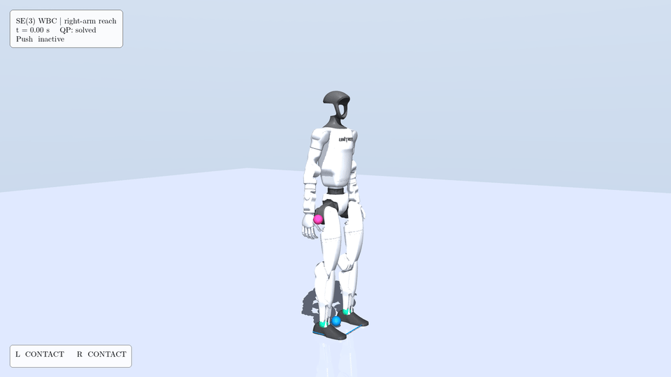
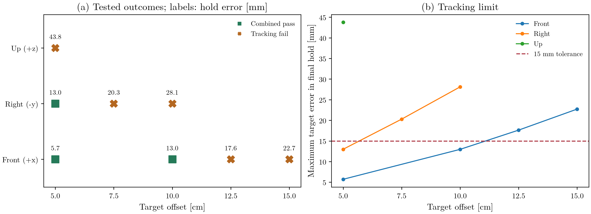
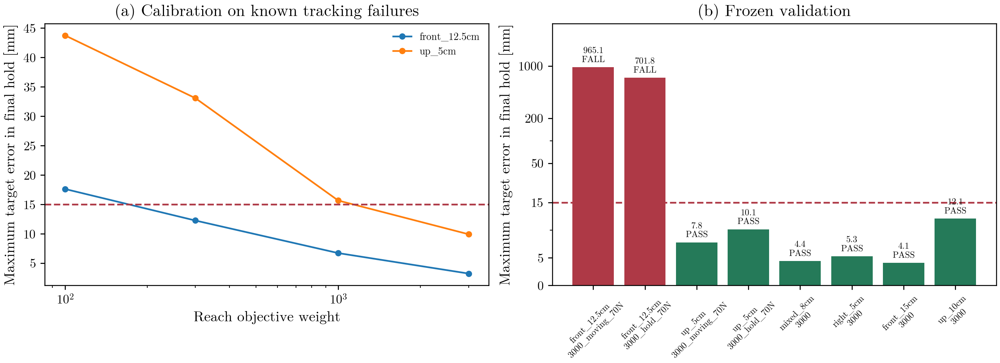
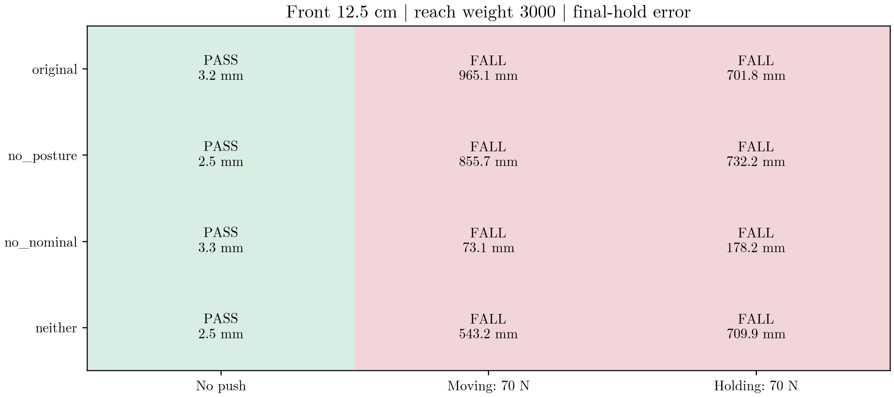
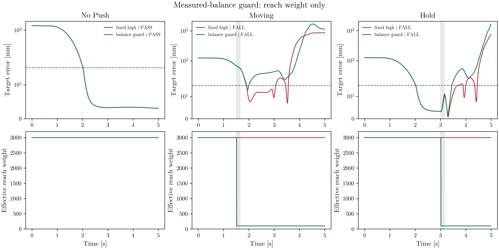

# Technical Notes and Experiment Archive

SE(3) geometric pose-error resolved-acceleration tasks embedded in a contact-constrained whole-body QP, evaluated on a floating-base Unitree G1 in MuJoCo.

The problem is fixed-foot balance under an unmeasured torso push. Geometry supplies the task error, optimization distributes acceleration/torque/contact predictions, and MuJoCo determines the actual ground reaction. No stepping or disturbance oracle is used in the primary comparison.

https://github.com/user-attachments/assets/219f1802-cab5-401b-a59f-0e4d30c8adbe

[Watch the synchronized H.264 comparison](../results/revalidation/g1_paired_a500081/videos/canonical_three_controller.mp4) · [Measured results](../results/revalidation/g1_paired_a500081/summary.json)

## Measured result

The primary push-recovery results use frozen scientific source `a50008145b0b47d4b874002bd656355cb14687de`. Gains, pushes and recovery thresholds were not tuned for this release. A numerical correctness fix rejects solver outputs that violate original, unscaled constraint rows, even when OSQP reports `solved`.

| Controller | Canonical 70 N | Recovery latency | Peak torso error | Peak CoM displacement | Peak joint torque |
|---|---|---:|---:|---:|---:|
| Pure PD | FALL | — | 1.8565 rad | 0.5731 m | 139.00 N m |
| PD + nominal FF | FALL | — | 2.2135 rad | 0.3878 m | 139.00 N m |
| SE(3) WBC | RECOVERED | 0.270 s | 0.0506 rad | 0.0812 m | 20.27 N m |

**Baseline qualification:** Pure PD also falls in the no-push standing sanity check. It is a feedforward-removal ablation, not a viable standing baseline. Its zero recovery rate must not be interpreted as a push-only effect. PD + nominal FF stands without push; the meaningful primary recovery comparison is PD + nominal FF versus SE(3) WBC.

| Controller | Calibration | Push sweep | Known-parameter robustness |
|---|---:|---:|---:|
| Pure PD (ablation) | 0/48 (0.0%) | 0/192 (0.0%) | 0/50 (0.0%) |
| PD + nominal FF | 10/48 (20.8%) | 32/192 (16.7%) | 0/50 (0.0%) |
| SE(3) WBC | 30/48 (62.5%) | 146/192 (76.0%) | 33/50 (66.0%) |

These headline outcomes match the historical paired benchmark at reported precision. This release is **not presentation-only**: numerical acceptance changed, all experiments were regenerated, and the larger mismatch study is new.


Orange shading marks the measured push interval. GRF is **actual MuJoCo contact force**, not the QP wrench. Spikes are retained. Torque and friction utilization are dimensionless, with physical boundaries at 1.0.


Each cell is measured, not interpolated. The [recovery envelope](../results/revalidation/g1_paired_a500081/figures/recovery_envelope.png) reports the largest *tested* recovered magnitude; it is not proof of a continuous stability boundary.

## Method

The G1 has 29 actuated joints and a floating pelvis. Physics runs at 2 ms; commands are held for 4 ms. The controller receives measured state, not an oracle copy of the push. Only actuator torques are sent to the plant.

### SE(3) convention

Poses map body coordinates into world coordinates. Production uses the **right-invariant spatial/world error**, translation first:

$$
E_s=T T_d^{-1}, \qquad \xi_e=\mathrm{Log}(E_s)^\vee
=[v_x,v_y,v_z,\omega_x,\omega_y,\omega_z]^T.
$$

The MuJoCo body-point Jacobian is converted to a spatial-twist Jacobian in the same world tangent frame. Desired-body tangent gains are transported with the desired pose adjoint:

$$
K_{p,s}=\mathrm{Ad}_{T_d}K_{p,d}\mathrm{Ad}_{T_d}^{-1},\qquad
a_s^*=-K_{p,s}\xi_e-K_{d,s}J_s\dot q.
$$

The production pose-task test exercises equivariance under a rigid change of world frame. This is a resolved-acceleration approximation, **not** a globally exact nonlinear tracking law or stability proof. The mass-weighted CoM Jacobian uses `mj_jacBodyCom` and is finite-difference tested.

### Whole-body QP and contacts

Variables are generalized acceleration, actuator torque, per-foot world wrench, and penalized contact-acceleration slack:

$$
x=[\ddot q,\tau,\lambda,s],\qquad M(q)\ddot q+h(q,\dot q)=B\tau+J_c^T\lambda,
$$

$$
J_c\ddot q+\dot J_c\dot q+s=0.
$$

Torso/pelvis pose, CoM, posture, acceleration and torque objectives share the QP. Slack is explicitly logged: a small residual of this *slack-containing equation* does not imply zero physical foot acceleration.

The horizontal friction approximation is conservative:

$$
F_z\ge0,\qquad |F_x|+|F_y|\le\mu F_z.
$$

This world-XY L1 diamond lies inside the Coulomb circle. Rectangular CoP bounds constrain $M_x=yF_z$ and $M_y=-xF_z$; torsional friction is bounded too. This is a flat-patch approximation, not an exact distributed contact wrench cone for arbitrary terrain or foot orientation.

Predicted and measured wrenches remain separate. The [wrench consistency diagnostic](../results/revalidation/g1_paired_a500081/figures/contact_wrench_consistency.png) shows their discrepancy.

### Numerical acceptance

OSQP's scaled global stopping criterion does not certify each physical constraint. Production checks every original row against its own absolute-plus-relative budget. A violation receives **one tighter numerical retry of the same QP**; persistent violations are rejected with an explicit fallback message. Wrenches are not clipped to hide violations.

The [contact audit](../results/revalidation/g1_paired_a500081/contact_audit.json) retains force-unit excesses, the strict 1 mN check, engineering-budget ratios, refinement counts and solver failures. This does not relax the physical classifier. Workspace reuse stays off in primary runs; the previous warm-start pilot is historical diagnostic evidence only.

## Experiments

### Fair comparison and recovery

A shared 0.6 s setup produces saved state and references. Every triplet receives identical qpos, qvel, targets and force traces. The canonical push is 70 N at 0°, lasting 0.15 s from 2.0 s: 75 physics substeps and 10.5 N s impulse.

There are 291 pushed conditions / 873 controller trials, plus six quiet/perturbed-standing sanity trials. The separate mismatch study adds 80 WBC trials. All CSV rows and per-trial summaries remain available, including failures.

PD and WBC use the same physical recovery criteria: torso error below 5°, angular velocity below 0.15 rad/s and horizontal CoM displacement below 0.10 m, held for 0.25 s within six seconds after the push. Fall, sustained contact loss/slip, actuator/joint limits, numerical failure and QP failure can disqualify a trial.

Slip uses measured tangential foot velocity, contact displacement and actual friction utilization. YAML thresholds are unchanged. `recovered_at_s` is the first sample of a subsequently confirmed stable interval:

$$
\text{recovery latency}=t_{\mathrm{recovered}}-t_{\mathrm{push,end}}.
$$


The support region is the convex hull of active foot vertices. CoM projection margin is a geometric diagnostic, not a dynamic viability certificate.

### Standing and robustness

Quiet standing is a sanity check. Perturbed standing injects a contact-preserving angular-rate perturbation **after** setup; no PD warmup erases it before WBC starts.

Both PD + nominal FF and WBC retain double support throughout the 3 s quiet/perturbed checks. The initial perturbed torso angular speed is 0.05098 rad/s for all controllers; peak orientation errors are 0.02821 rad (PD + FF) and 0.00328 rad (WBC). This small perturbation is already inside the recovery band, so its classifier latency is not a meaningful settling-time benchmark.

The 50-condition three-controller robustness study varies friction, mass and duration with five genuinely randomized seeds. This is a **known-parameter sweep**, not model uncertainty.

The separate 80-trial mismatch diagnostic pairs known and nominal internal models on the same plant, state and randomized force trace: mass scales 0.9/1.1 or friction 0.3/0.5, longitudinal/lateral nominal 70 N pushes, five seeds. Unknown models retain nominal mass/friction. This is a WBC model-knowledge comparison, not a claim of universal superiority over PD.

Known models recover **24/40 (60.0%)** and nominal/unknown models **26/40 (65.0%)**. Among the 40 knowledge pairs, 22 both recover, 12 both fail, 2 recover only with known parameters and 4 only with the nominal model. Known-only wins occur in low-friction lateral pushes; nominal-only wins occur at mass scale 0.9. This small study does not establish universal benefit from either model-knowledge mode.

Canonical WBC solve timing on the shared CPU worker is **mean 3.771 ms, p95 6.523 ms, p99 6.823 ms, max 37.399 ms**. The control deadline is **4 ms**, missed by **22.13%** of calls. These are wall-clock measurements from this run, not a replicated runtime benchmark or a hard-real-time claim.

Across all 373 WBC trajectories, every accepted prediction passes the declared force budget and the strict 1 mN audit: maximum L1 excess **0.000999 N**. The log retains **77,281 numerical retries** and **86 rejected solves**. Failure trials and fallback calls are not removed.

[Actual GRF](../results/revalidation/g1_paired_a500081/figures/actual_ground_reaction_forces.png) · [Physical slip](../results/revalidation/g1_paired_a500081/figures/contact_slip_diagnostics.png) · [QP timing](../results/revalidation/g1_paired_a500081/figures/qp_timing_diagnostics.png)

## Reach-and-Balance: first milestone

An optional **right-arm Cartesian position task** extends the existing fixed-foot
QP without changing the published push-recovery benchmark. It tracks a point
80 mm along the local x-axis of `right_wrist_yaw_link`; wrist orientation is free.
This is virtual-target reaching, not grasping or object manipulation.

The world-frame target offset is `[80, -30, 20]` mm from the settled endpoint.
A rest-to-rest quintic reference starts at 0.5 s and moves for 2 s, followed by a
hold until 5 s. The disturbed trial applies 70 N along world +x at 1.5 s for
0.15 s. The controller receives no oracle copy of that force.

The added objective uses the point Jacobian and its acceleration bias:

$$
J_r\ddot q \approx \ddot p_d + K_p(p_d-p)
+ K_d(\dot p_d-J_r\dot q)-\dot J_r\dot q.
$$

Existing dynamics/contact constraints, numerical row acceptance, posture and
balance objectives remain unchanged. Reaching is a soft weighted objective,
not a formal task-priority or stability guarantee.

| First deterministic trial | No push | 70 N push during reach |
|:--|--:|--:|
| Final target error | 8.88 mm | 6.98 mm |
| Target held within 15 mm for final 0.5 s | Yes | Yes |
| Physical balance classifier | Passed | Passed |
| Both feet contacted throughout | Yes | Yes |
| QP failures | 0 | 0 |

These two trials are feasibility checks, not a workspace or robustness study.
The smaller disturbed-trial endpoint error is not evidence that disturbance
improves control. Startup recovery time is not the time needed to finish reaching.
The nearby target produces modest arm motion; larger reaches remain unvalidated.



[Full 1080p MP4](../results/reaching/ff989e0/push/reach_and_balance.mp4) ·
[Tracking and measured contacts](../results/reaching/ff989e0/push/reaching_response.png) ·
[Raw trial summary](../results/reaching/ff989e0/push/summary.json)

Both new trials are generated from source checkpoint
`ff989e047ffd2dbf779374738bb897a2d607a511`, independently of the historical
push-recovery results. NPZs include endpoint/reference trajectories, actual and
predicted contact wrenches, physical slip telemetry, joint states and provenance.
GIF/MP4 frame selection follows physical simulation timestamps.

On this reaching checkpoint, with dependencies installed:

```bash
python experiments/reach_and_balance.py --output results/staging/reach-no-push --render
python experiments/reach_and_balance.py --output results/staging/reach-push --push-N 70 --render
```

Each command refuses nonempty output directories. Heavy simulation and rendering
are run on the SSH execution worker; the local repository remains canonical.

## Reach-and-Balance: sampled target limits

The next milestone samples three world-frame rays from the same settled endpoint:
front (+x), right (-y), and up (+z). It keeps the first milestone's gains, task
weights, 2 s quintic motion, 5 s trial, and 15 mm tolerance over the final 0.5 s.
No controller tuning or threshold relaxation is used to improve these results.

There are **18 WBC trials**: two baseline regressions, eight no-push target trials,
and eight disturbed trials. Both regressions reproduce the saved physical
trajectories at `rtol=1e-8, atol=1e-9`, including joint state, endpoint motion,
torque, and measured contacts. All trials share one saved initial-state hash.

| Direction | Tested combined passes | First tested tracking failure | Maximum final-hold error at that failure |
|:--|:--|:--|--:|
| Front | 5 and 10 cm | 12.5 cm | 17.62 mm |
| Right | 5 cm | 7.5 cm | 20.28 mm |
| Up | None at the tested 5 cm target | 5 cm | 43.76 mm |

The original coarse grid also retains front 15 cm and right 10 cm failures.
The study stops increasing a ray after its first coarse failure and tests one
midpoint when a smaller nonzero target passed. Smaller upward offsets are not
tested. These are **sampled task limits under fixed weights**, not a complete
kinematic workspace, continuous boundary, or proof that larger targets are
unreachable. All eight no-push trials retain physical balance and double support;
five fail the endpoint tracking requirement.



Squares mark combined passes and crosses mark tracking failures. Lines connect
tested points only; they do not establish outcomes between samples.

The disturbance subset uses front 5 cm and right 5 cm targets, with 40/70 N
world +x pushes for 0.15 s, either during motion (1.5 s) or hold (3 s).
**Seven of eight pass both tasks.** Right 5 cm with 70 N during hold fails
tracking: maximum final-hold error is **15.156 mm**, despite final endpoint
error of **13.292 mm** and valid physical balance. A final-frame-only test
would incorrectly declare that trial successful.

Each study outcome adds a whole-task physical check from the existing startup
grace period, including the push interval, and requires the final hold to remain
inside the original balance thresholds. The historical post-push recovery result
is retained separately. Zero QP failures and continuous double support are
recorded for all 18 WBC trials; shared-worker 4 ms deadline misses remain
25.2-72.64%, so this extension does not establish real-time execution.

[Watch the 15 s montage](../results/reaching_workspace/1c63402_final/videos/reaching_montage.mp4)
shows front 5 cm (easy), front 10 cm (near the tested limit), and front 12.5 cm
(tracking failure). Each full 5 s trajectory is replayed at physical speed.
The failure is a missed target while standing, not a fabricated fall.

### PD qualification pilot

A PD + fixed nominal equilibrium feedforward pilot receives an offline bounded
seven-joint right-arm IK reference sampled at 30 Hz and interpolated for the
250 Hz control loop. Its Cartesian reference, initial state and force trace are
verified identical to the saved WBC front 5 cm trial. The maximum IK waypoint
error is 0.00049 mm, but the simulated PD controller **falls without any push**.
The qualification gate therefore stops before disturbed PD trials. This failed
pilot does not support a reaching push-recovery superiority claim; it identifies
a baseline that needs separate qualification without tuning on the test set.

[PD pilot evidence](../results/reaching_pd/47d2719/comparison.json) retains the failed
trajectory, physical telemetry, reference check and provenance.

### Reproduction and evidence

WBC scientific source is `1c63402aa19eb42678e85b045d02b02eb978cf66`; PD pilot
source is `47d2719c660c1ca48561b0068c00a9cee7caa890`. Presentation source
`455cf22d7add99be70ca7f3196108dd7c6d4d9d6` adds headless rendering and corrected
failure labels without rerunning dynamics. All new raw trajectories are retained.

From the corresponding checkout on the SSH worker, with the first milestone's
`results/reaching/ff989e0` regression trajectories available:

```bash
export PYTHONPATH=src:scripts MUJOCO_GL=egl
export OPENBLAS_NUM_THREADS=1 OMP_NUM_THREADS=1
export SE3_SOURCE_VERSION=$(git rev-parse HEAD)
python experiments/reaching_workspace.py --output results/staging/reach-study
python experiments/reaching_pd_comparison.py --wbc-study results/staging/reach-study --output results/staging/reach-pd
python experiments/reaching_workspace.py --output results/staging/reach-study --render-only
python scripts/verify_reaching_workspace.py --root results/staging/reach-study --record
```

For exact source attribution, run the WBC study at its scientific checkout,
then switch to the PD/presentation checkouts with the raw study unchanged.
New simulation outputs and presentation directories refuse existing destinations.

[All trial outcomes](../results/reaching_workspace/1c63402_final/study.csv) |
[Study definition](../results/reaching_workspace/1c63402_final/study.json) |
[Verification](../results/reaching_workspace/1c63402_final/verification.json) |
[Artifact hashes](../results/reaching_workspace/1c63402_final/manifest.json)

## Reach-and-Balance: tracking calibration

The next experiment varies **only the Cartesian reach objective weight**.
The original default remains 100. Plant parameters, initial conditions,
reference timing, all other gains and weights, contact/torque constraints,
and the 15 mm final-hold tolerance are unchanged.

Two known failures are used for calibration: front 12.5 cm and up 5 cm.
Weights 300, 1000, and 3000 are tested in that order. The first weight passing
both combined task/physical checks is 3000, then frozen before validation.
The two weight-100 trajectories reproduce the earlier worker results within
the published numerical tolerances. Within-study reference, force and initial
state pairs are checked exactly.

| Calibration target | Hold error, weight 100 | Hold error, weight 3000 |
|---|---:|---:|
| Front 12.5 cm | 17.62 mm, tracking fail | 3.23 mm, combined pass |
| Up 5 cm | 43.76 mm, tracking fail | 9.92 mm, combined pass |

Frozen validation passes 6/8 trials: mixed 8 cm, right 5 cm, front 15 cm,
and up 10 cm without push, plus up 5 cm with 70 N pushes during motion and
hold. **Front 12.5 cm falls with both 70 N pushes at weight 3000.**
Front 15 cm and up 10 cm no-push hold errors are 4.09 mm and 12.07 mm,
respectively. These are sampled outcomes, not a complete workspace claim.

A separate six-trial follow-up repeats the pushed calibration targets at
weight 100 and probes front 12.5 cm at weight 300. The weight-100 front robot
remains physically balanced with both pushes; motion passes, hold fails
tracking. Weight 300 passes the motion push but fails the hold push with
slip. Weight-100 up trials remain balanced but fail tracking. These follow-up
trials are **exploratory controls, not additional held-out validation**.

This supports a tracking/balance trade-off in the existing weighted QP.
Increasing reach weight improves accuracy but is not a safe global fix.
**No automatic target-dependent tuning, default promotion, or PD claim is
made.** The CLI override is opt-in: `--reach-weight 3000`.



Scientific calibration/validation source: `fbc0b509402bc8d60a365c0b612d331a120fdc88`.
Follow-up control source: `d240d2d`; refined presentation source: `66a23f8`.
There are 16 primary trials and six controls. Runs use local Windows CPU
after SSH source transfers repeatedly returned `Connection reset`; original
worker artifacts are preserved. Local runs record 100% 4 ms deadline misses,
so these results make **no hard-real-time claim**. Source and dependency
versions are recorded in each trial summary. The untracked historical
experiment wrappers are not used or changed.

Reproduce in fresh output directories with the declared dependencies:

```bash
export PYTHONPATH=src:scripts OPENBLAS_NUM_THREADS=1 OMP_NUM_THREADS=1
export SE3_SOURCE_VERSION=$(git rev-parse HEAD)
python experiments/reaching_tracking_study.py --previous results/reaching_workspace/1c63402_final --output results/staging/tracking-study
python experiments/reaching_tracking_study.py --previous results/reaching_workspace/1c63402_final --validation-controls-for results/staging/tracking-study --output results/staging/tracking-controls
python scripts/verify_reaching_workspace.py --root results/staging/tracking-study --record
python scripts/verify_reaching_workspace.py --root results/staging/tracking-controls --record
```

Cross-platform replay inputs allow absolute rounding error of `1e-12`;
trajectory replay uses `rtol=1e-8, atol=1e-9`. Physical success thresholds are
never relaxed. Refined figures use a labeled symmetric-log validation scale
so falls and small successful tracking errors both remain visible.

[Primary trial CSV](../results/reaching_tracking/fbc0b50_local/study.csv) |
[Primary verification](../results/reaching_tracking/fbc0b50_local/verification.json) |
[Exploratory controls](../results/reaching_tracking/d240d2d_controls/study.csv) |
[Control figure](../results/reaching_tracking/d240d2d_controls/presentation/tracking_results.png) |
[Primary hashes](../results/reaching_tracking/fbc0b50_local/manifest.json) |
[Control hashes](../results/reaching_tracking/d240d2d_controls/manifest.json)

## Reach-and-Balance: objective conflict audit

A controlled audit tests whether removing posture regulation, nominal-torque
regularization, or both fixes front 12.5 cm with reach weight 3000. There are
nine new local trials and three reused immutable baselines. **All four modes
pass without push; all eight pushed cases fall.** No objective is removed
from the default controller and the default reach weight remains 100.

Eight pre-contact-loss baseline states are replayed in four modes. Original
controls match the recorded controls, and constraint matrices/bounds are
identical across modes. This separates soft-objective effects from accidental
constraint changes. Recorded measured forces belong to the original states,
not hypothetical new physical outcomes of frozen QP solves.

Every ablation loses physical contact earlier than the original. In the
original moving trial, first contact loss occurs at 2.904 s, before torque
saturation at 3.596 s and QP failure at 4.228 s. The original hold trial falls
without any QP failure. These findings do not establish a unique root cause,
but rule out these deletions as fixes for the tested cases. The next narrow
experiment should bound reach influence from measured balance/contact state
before contact loss, retaining the stabilizing objectives and tracking gate.



Audit/ablation source: `04bf33403299ba8cb6313cf081dfb3b984d4cea5`.
Reused baseline provenance stays at `fbc0b50`. 81 tests pass locally and on
the SSH worker; physical trials were not replicated on the worker. Worker
transfer succeeds with legacy `scp -O`. No hard-real-time claim is made.

```bash
export PYTHONPATH=src:scripts OPENBLAS_NUM_THREADS=1 OMP_NUM_THREADS=1
export SE3_SOURCE_VERSION=$(git rev-parse HEAD)
python experiments/reaching_conflict_audit.py --previous results/reaching_tracking/fbc0b50_local --output results/staging/conflict-audit
python scripts/verify_reaching_workspace.py --root results/staging/conflict-audit --record
```

[Audit findings and event timing](../results/reaching_conflict/04bf334_local/AUDIT.md) |
[Paired trial CSV](../results/reaching_conflict/04bf334_local/study.csv) |
[Frozen-state objective measurements](../results/reaching_conflict/04bf334_local/study.json) |
[Verification](../results/reaching_conflict/04bf334_local/verification.json) |
[Artifact hashes](../results/reaching_conflict/04bf334_local/manifest.json)

## Reach-and-Balance: measured-balance guard pilot

**Neither prototype passes the pilot. Do not promote either policy to the default.**
Twelve five-second physical trials ran on the SSH CPU worker: two independent
six-trial pilots, each pairing fixed reach weight 3000 with an opt-in guard.
The target is front 12.5 cm. Conditions are no push, 70 N during motion at
1.5 s, and 70 N during holding at 3.0 s; pulse duration is 0.15 s.

The guard reduces reach weight to the unchanged default 100 whenever measured
torso orientation, angular speed, CoM XY displacement, or either contact flag
leaves the existing recovery bands. It requires 0.25 s continuously stable,
then restores the weight linearly over another 0.25 s. No push schedule or
force magnitude enters this decision. The second, separately recorded prototype
also updates only the seven right-arm posture references to measured positions
during reduced reach authority, retaining damping, gravity and all other joint
references. Objective weights and physical success thresholds are unchanged.

Both prototypes reproduce the nominal trajectory: final-hold maximum error
3.231 mm, no guard reduction. All four guarded pushed trials and all four fixed
pushed controls fall. The guard first reduces at 1.520 s / 3.020 s, before
contact loss, but early activation alone does not recover balance. Both pilot
gates are false; the proposed right/up/mixed validation grid is not run.



Source snapshots are `07ffc0fa2283bee03d59f643d48c2a167a45f7fd` (weight only)
and `11ebc63ab6c4d23f64b99bb70f653d21d9982f49` (arm posture adaptation).
All paired inputs match within each worker pilot. Historical local nominal
replay matches within declared floating-point tolerances, not byte-identical
cross-platform hashes. Saved weights and arm references replay from measured
state. Full suites pass 83 tests locally and on the worker. CPU deadline misses
remain recorded; there is no hard-real-time or unique-root-cause claim.

Reproduce into fresh directories with the indicated source checkout:

```bash
export PYTHONPATH=src:scripts OPENBLAS_NUM_THREADS=1 OMP_NUM_THREADS=1
export SE3_SOURCE_VERSION=$(git rev-parse HEAD)
python experiments/reaching_guard_study.py --previous results/reaching_tracking/fbc0b50_local --output results/staging/guard-weight
python experiments/reaching_guard_study.py --previous results/reaching_tracking/fbc0b50_local --output results/staging/guard-arm --guard-arm-posture
python scripts/verify_reaching_workspace.py --root results/staging/guard-weight --record
python scripts/verify_reaching_workspace.py --root results/staging/guard-arm --record
```

[Pilot report and event timing](../results/reaching_guard/07ffc0f_worker/REPORT.md) |
[Weight-only trial CSV](../results/reaching_guard/07ffc0f_worker/study.csv) |
[Arm-adaptation trial CSV](../results/reaching_guard/11ebc63_arm_worker/study.csv) |
[Arm-adaptation figure](../results/reaching_guard/11ebc63_arm_worker/presentation/guard_results.png)

Next diagnostic: compare predicted contact acceleration and slack with measured
foot motion after the pulse and before contact loss. Contact-model drift is an
unverified hypothesis, not an established explanation. No further gain sweep,
payload, grasping or stepping is added by this pilot.

## Limitations

- Fixed-foot double support on flat ground; no walking, hardware transfer or general locomotion claim.
- Conservative L1/rectangular-patch contact approximation; predicted and measured forces differ.
- Contact acceleration uses explicit, heavily penalized slack.
- Shared-worker CPU timings are not hard-real-time measurements; 4 ms deadline misses are retained.
- Finite grids and five-seed diagnostics do not establish population robustness or nonlinear stability.
- Historical arena/stepping prototypes remain outside this benchmark and its claims.

## Reproduction

Install Python 3.10+ and the declared dependencies. Exact final package versions are recorded in the manifests.

```bash
python -m venv .venv
source .venv/bin/activate
python -m pip install -e '.[dev]'
export MUJOCO_GL=egl  # headless Linux only
export OPENBLAS_NUM_THREADS=1 OMP_NUM_THREADS=1
python -m pytest -q
```

Use science checkout `a50008145b0b47d4b874002bd656355cb14687de`. Each stage refuses existing output:

```bash
OUT=results/staging/reproduction
python experiments/paired_benchmark.py prepare --output-root "$OUT"
python experiments/paired_benchmark.py gates --output-root "$OUT"
python experiments/paired_benchmark.py canonical --output-root "$OUT" --workers 8
python experiments/paired_benchmark.py calibration --output-root "$OUT" --workers 8
python experiments/paired_benchmark.py sweep --output-root "$OUT" --workers 8
python experiments/paired_benchmark.py robustness --output-root "$OUT" --workers 8
python experiments/paired_benchmark.py mismatch --output-root "$OUT" --workers 8
python scripts/audit_contact_residuals.py --raw-root "$OUT/raw" --output "$OUT/contact_audit.json"
```

After the scientific stages finish, use presentation checkout `5428497a3af6b299819a39736cffaab511fd6256` (or the final release), keeping the same raw output directory:

```bash
python scripts/render_paired_comparison.py --data-root "$OUT" --output results/staging/comparison.mp4
python scripts/package_paired_benchmark.py --raw-root "$OUT" --output-root results/staging/publication --video results/staging/comparison.mp4 --trajectory-limit 8
python scripts/verify_paired_artifacts.py --root results/staging/publication
```

Video samples saved trajectories by timestamp at 30 FPS; rendering does not rerun dynamics. The synchronized H.264 video is 1920×1080, 245 frames, approximately 8.167 s, matching the 8.152 s simulated sample span to video-frame precision.

Presentation checkpoint `5428497a3af6b299819a39736cffaab511fd6256` corrects CFF font embedding, rounds angular tick labels, and improves camera/overlay readability; simulation/control/evaluation source remains `a500081`. Important figures have PNG/PDF exports. Bundled Latin Modern faces are embedded as vector glyph programs rather than invalid TrueType wrappers; text/lines are not rasterized.

## Provenance and repository

[Summary](../results/revalidation/g1_paired_a500081/summary.json) · [Raw inventory](../results/revalidation/g1_paired_a500081/remote_raw_manifest.json) · [Curated hashes](../results/revalidation/g1_paired_a500081/curated_manifest.json) · [Verification](../results/revalidation/g1_paired_a500081/verification.json)

Full raw trajectories remain in the worker archive. GitHub retains canonical/standing NPZs and up to eight deterministically selected conditions per noncanonical stage, with **all** CSV rows and sanitized JSON summaries. Large NPZ/MP4 files use Git LFS; credentials, environments, staging and temporary frames are ignored.

CSV `trial_summary_path` addresses the original raw inventory. Its public sanitized counterpart is `trial_summaries/<stage>/<trial_id>.json`.

Source is under `src/se3_whole_body_control/`; experiments, configs and tests are versioned. Previous `g1_paired_b114efb` and `contact_audit_eaef962` remain historical evidence, not current benchmark results.

See [model attribution](../models/unitree_g1/UPSTREAM.md) and the [GUST font license](../assets/fonts/latin-modern/GUST-FONT-LICENSE.txt). Project-owned source has no separate top-level license declared; check the owner's terms before redistribution.

```bibtex
@software{aimldlnlp_se3_g1_push_recovery,
  author = {{aimldlnlp}},
  title = {SE(3) Whole-Body Push Recovery for Unitree G1},
  year = {2026},
  url = {https://github.com/aimldlnlp/se3-humanoid-push-recovery}
}
```
